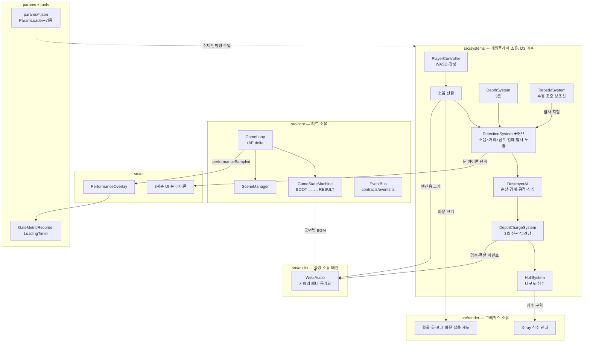

# ARCHITECTURE — 시스템 아키텍처

> 기준: `docs/deep_dive_master_plan.md` §7. 이 문서는 코드 관점 요약이다.

## 구성 요소

### 게임 루프 (`src/core/GameLoop.ts`)
`requestAnimationFrame` 기반. delta time(초)을 계산해 `update(dt)` →
`render()`를 분리 호출한다. 탭 복귀 등 프레임 튐은 0.1초로 클램프.
게임 규칙·렌더 내용은 모른다.

### 상태 머신 (`src/core/GameState.ts`, `GameStateMachine.ts`)
`BOOT → DEPARTURE → APPROACH → ATTACK → ESCAPE → RESULT (→ DEPARTURE)`.
허용 전환표(`STATE_TRANSITIONS`) 밖의 전환은 예외를 던진다. 전환 성공 시
`gameStateChanged` 이벤트 발행. 전환 **조건** 판정(게임 규칙)은 D6 이후
시스템들이 담당한다.

### EventBus (`src/core/EventBus.ts` + `src/contracts/events.ts`)
게임플레이·렌더·사운드·UI 간 유일한 통신 경로. 이벤트 이름·페이로드는
`GameEvents` 계약으로 타입 강제된다. 모듈 간 직접 import 참조 금지
(계약·core 제외).

### 시스템 계약 (`src/contracts/systems.ts`)
9개 인터페이스: PlayerController / DepthSystem / DetectionSystem /
TorpedoSystem / DepthChargeSystem / DestroyerAI / HullSystem / AudioSystem /
UISystem. **구현체는 아직 없다** — D3 이후 각 파트 소유 영역에서 구현한다.
목록·소유자·입출력은 `docs/INTERFACES.md` 표 참조.

## 핵심 설계 결정

### DetectionSystem이 시스템 허브다
소음·심도·엄폐·발사 노출을 입력받아 **단일 탐지 게이지**를 산출하고,
구축함 AI 상태 전이와 눈 아이콘 UI를 구동한다. D6~D9에는 임시 구현을
쓰되 인터페이스는 유지하며, D10~D12 본 구현 교체 시 내부만 바뀐다 [확정].

### 소음 값의 삼중 출력
소음 값 하나(`noiseChanged.level`)가 동시에 세 곳으로 분배된다:
① 탐지 게이지 입력 ② 파문 이펙트 크기(렌더) ③ 엔진음 크기(오디오).
시청각 일치 원칙의 구현점이며, 파문 이펙트는 보호 목록이다.

### 폭뢰 판정과 오디오 배관의 책임 분리
'풍덩→3초→폭발'의 **타이밍 주인은 판정 로직(DepthChargeSystem, 게임플레이
소유)**이다. 오디오(툴링 소유 배관)는 `depthChargeEnteredWater`/
`depthChargeExploded` 이벤트에 동기화만 하고, 지연 100ms+ 시 보상 오프셋을
적용한다. 보호 목록 '폭뢰 사운드 동기화'의 책임 경계.

### 파라미터는 단방향
`params/*.json` → `config/ParamLoader`(런타임 범위 검증) → 시스템 주입.
역방향(코드→JSON 기록) 금지. 기획이 params를 직접 커밋한다.
범위를 벗어난 값은 로드 시점에 `ParamValidationError`로 거부된다.

## 구조도

## D1~D2 실제 배선 (현재)

`main.ts` → `Game`: 파라미터 로드·검증 → `Renderer`+`BootstrapScene` 생성 →
오버레이·계측 연결 → 루프 시작 → 첫 렌더 시 `LoadingTimer` 기록 +
`BOOT→DEPARTURE` 전환(상태 머신 검증 겸용). 게임플레이 시스템은 아직 없다.
