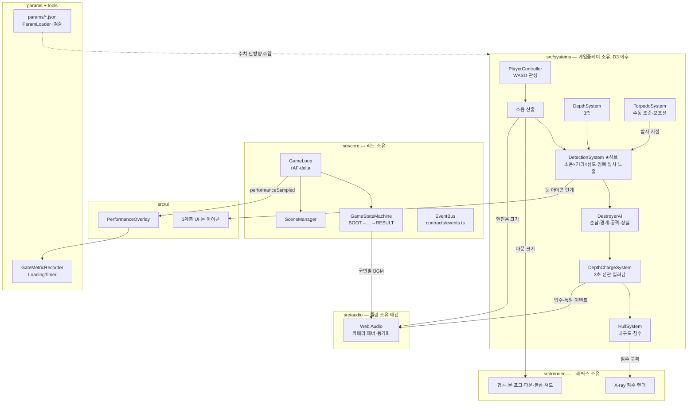

# ARCHITECTURE — 시스템 아키텍처

> 기준: `docs/deep_dive_master_plan.md` §7. 이 문서는 코드 관점 요약이다.

## 구성 요소

### 게임 루프 (`src/core/GameLoop.ts`)
`requestAnimationFrame` 기반. delta time(초)을 계산해 `update(dt)` →
`render()`를 분리 호출한다. 탭 복귀 등 프레임 튐은 0.1초로 클램프.
게임 규칙·렌더 내용은 모른다.

### 상태 머신 (`src/core/GameState.ts`, `GameStateMachine.ts`)
`BOOT → DEPARTURE → APPROACH → ATTACK → ESCAPE → RESULT (→ DEPARTURE)`.
허용 전환표(`STATE_TRANSITIONS`) 밖의 전환은 예외를 던진다. 전환 성공 시
`gameStateChanged` 이벤트 발행. 전환 **조건** 판정(게임 규칙)은 D6 이후
시스템들이 담당한다.

### EventBus (`src/core/EventBus.ts` + `src/contracts/events.ts`)
게임플레이·렌더·사운드·UI 간 유일한 통신 경로. 이벤트 이름·페이로드는
`GameEvents` 계약으로 타입 강제된다. 모듈 간 직접 import 참조 금지
(계약·core 제외).

### 시스템 계약 (`src/contracts/systems.ts`)
10개 인터페이스: PlayerController / DepthSystem / DetectionSystem /
AimSystem / TorpedoSystem / DepthChargeSystem / DestroyerAI / HullSystem /
AudioSystem / UISystem. 구현은 각 파트 소유 영역에서 한다 — D+5 기준
PlayerController·DepthSystem 구현 완료, 나머지는 D6 이후.
목록·소유자·입출력은 `docs/INTERFACES.md` 표 참조.

### 시스템 수명주기·등록 (`src/core/GameSystem.ts`, `SystemRegistry.ts`)
각 파트 구현체는 `GameSystem`(id / `initialize` / `update` / `render?` /
`dispose`)을 구현해 `SystemRegistry`에 등록된다. 호출 규약은 core가 보장한다:

- `initialize(context)` — 루프 시작 전 등록 순서대로 1회. `SystemContext`로
  `bus`(EventBus)·`params`(검증 완료 파라미터)·`stateMachine`을 공급받는다.
  그 외 의존성(렌더러 등)은 등록 지점에서 생성자 주입.
- `update(deltaSeconds)` — 매 프레임 등록 순서대로. 시뮬레이션만, 그리기 금지.
- `render()` — 매 프레임, SceneManager의 3D 장면 렌더 **후** 등록 순서대로.
  화면 표현이 있는 시스템(UI 등)만 선택 구현.
- `dispose()` — 루프 정지 시 등록 **역순** 1회. 구독 해제·자원 정리.

등록 중복 id·초기화 이후 등록·initializeAll 재호출은 예외로 거부한다.
시스템 내부 예외는 삼키지 않고 전파한다 (상태 머신과 동일 원칙).

## 시스템 실행 순서

**실행 순서 = 등록 순서**다. 우선순위 숫자·의존성 그래프는 도입하지 않는다.
유일한 등록 지점은 `Game.composeSystems()`이며, 그룹 순서는 다음을 지킨다:

1. **입력·조작** — PlayerController, DepthSystem, 카메라 (게임플레이, D3~D5)
2. **판정** — 탐지·어뢰·폭뢰·내구도 (게임플레이, D6 이후)
3. **AI** — DestroyerAI (리드, D6 이후)
4. **표현 연동** — 렌더 이펙트·UI·오디오 배관 (이벤트 구독 측)

프레임 전체 순서 (core/Game):
```
update:  registry.update(dt) → sceneManager.update(dt) → 성능 샘플링
render:  sceneManager.render()  [3D 장면] → registry.render()  [UI 계층]
```

`src/core`는 공통 보호 파일이므로 등록 배선 추가는 feat→dev 병합 시
리드가 수행한다. 각 파트는 자기 소유 영역에서 `GameSystem` 구현체를
export하고, CURRENT_STATUS의 자기 구역에 "등록 요청" 형태로 알리면 된다.

## 공통 공간·방향 규약 (`src/core/conventions.ts`)

D+5 플레이테스트 리뷰 후속 확정 (INT-CORE-002). 이동·카메라·프로펠러·UI·
어뢰는 축 방향을 추측하지 않고 이 파일의 상수·함수를 참조한다.

### 축·선수·선미 [확정]
- **잠수함 로컬 -Z = 선수(bow), 로컬 +Z = 선미(stern), 월드 +Y = 위.**
  코드 기준: `LOCAL_BOW` / `LOCAL_STERN` / `WORLD_UP`.
- `headingRadians`는 Y축(위) 기준 요(yaw). heading 0의 선수 방향은 월드
  (0, 0, -1). 렌더는 `meshYawRadians(heading)`(= heading 그대로)를
  `mesh.rotation.y`에 대입 — 모델은 로컬 -Z가 선수가 되도록 제작·임포트한다.
- **이동 방향 기준은 잠수함 로컬 축** — 카메라 기준이 아니다 (§3.3 확정).
  전진 벡터 = `bowDirectionXZ(heading)` = (-sin h, -cos h).

### 카메라 리센터 [확정 — INT-CORE-004 개정]
Space 리센터 = **선미 뒤쪽 상단에서 선수 방향을 바라보는 후방 뷰.**
위치와 시선은 **서로 다른 함수**로 구분한다 — 하나의 yaw 값을 두 의미로
재사용하지 않는다:

- **위치**: 카메라 위치 = 잠수함 위치 +
  `cameraRecenterOffsetDirectionXZ(heading)`(= 선미 방향) × 추적 거리
  (+ 상단 높이·기본 피치 — 렌더 소유 시각 구도 상수).
- **시선**: `cameraRecenterLookDirectionXZ(heading)`(= 선수 방향).
  lookAt 대상을 잠수함으로 두면 자동 충족된다.
- **검증 기준**: 리센터 직후 ① 프로펠러(선미)가 카메라에 가장 가까운 쪽에
  보이고 ② W 전진 시 잠수함이 화면 안쪽(멀어지는 방향)으로 나아간다.

이력: 구 `cameraRecenterYawRadians`(heading+π)는 '시선 요'와 '위치 오프셋
요'로 이중 해석됐고, 구 CameraRig는 이 값을 위치 오프셋으로 써서 실제로는
카메라가 **선수 쪽**에 배치되는 결함(W 전진 시 화면 바깥쪽 이동)이 있었다.
해당 함수는 폐기 — 위 두 방향 벡터 함수만 사용한다.

### 어뢰 생성 [확정]
어뢰는 **선수 방향에서 생성**된다 — 생성 방향은 `bowDirectionXZ(heading)`를
사용한다 (D6 TorpedoSystem 구현 시 적용). 선수 오프셋 거리는 구현 상수.

### 프로펠러 [확정]
- 배치: **선미**(`LOCAL_STERN`).
- 회전은 **실제 전후 속도값에만 연결**한다 — A/D 선회 단독 입력은 회전에
  영향을 주지 않는다. 회전 비율 계산은 `propellerSpinRatio(speed, maxSpeed,
  idleRatio)` 하나만 사용한다 (속도 외 입력을 받지 않는 시그니처로 강제).
- 정지 상태 공회전: 최대 회전의 8%가 기본값이며
  `params/movement.json propellerIdleSpinRatio`(FixedNumber, 0~1 검증)로
  외부 조정한다. 최대 회전 각속도(rad/s)·감쇠 등 연출 상수는 렌더 소유.
- 속도 소스 [INT-CORE-003 확정]: **공식 부호 있는 전후 속도
  `SubmarinePoseSource.forwardSpeedMetersPerSecond`(contracts/systems.ts)만
  사용한다.** 렌더가 위치 변화(전 프레임 차분)로 속도를 재계산하는 것은
  금지 — 판정 상태의 복제 계산이며 프레임 순서에 따라 값이 어긋난다.
  회전 비율 = `conventions.propellerSpinRatio(forwardSpeed, maxSpeed,
  idleRatio)`, 회전 방향 = forwardSpeed의 부호.
- 파라미터 단일 소스 [INT-CORE-003 확정]: `propellerIdleSpinRatio`와 최고
  속력(`maxSpeedMetersPerSecond`)의 공식 소스는 **`params/movement.json`
  하나다.** 렌더 시각 설정(`src/render/renderVisualParams.json`)에 같은
  값(idleSpinRatio, fullSpinAtSpeedMps 등)을 중복 정의하지 않는다 — 두 값은
  composition root가 검증 완료 params에서 렌더에 주입한다. renderVisualParams
  에는 movement와 겹치지 않는 순수 연출 수치(최대 각속도·감쇠 등)만 남긴다.

## 조준 입력 단일화 (AimSystem)

마우스(우클릭)와 PC 화면 HUD 조준·발사 버튼은 **별도 전투 경로 없이 동일한
`AimSystem`**(contracts/systems.ts)을 호출한다 [D+5 리뷰 후속 소회의 확정]:

- 공용 진입점: `beginAim()`(**전 심도 허용** — 7차 결의 1로 구 '잠망경 심도
  전용' 규칙 폐기, 재도입 금지) / `endAim()`(미세 조준각 reset) /
  `fireTorpedo()`(TorpedoSystem 위임). 읽기 상태 `aiming`.
- 입력 어댑터(마우스=게임플레이 입력, HUD 버튼=UI)는 composition root
  (`Game.composeSystems`)에서 같은 AimSystem 인스턴스를 주입받는다 —
  서로를 import하지 않는다.
- 조준 뷰 카메라 고정(§3.2)·UI 표시는 `aimModeChanged` 이벤트 구독으로
  처리한다 (렌더·UI가 게임플레이를 직접 참조하지 않음).
- 구현은 게임플레이 소유, D6 이후. 계약만 선확정해 마우스·HUD가 서로 다른
  방향으로 구현되는 것을 막는다.

## 통합 상태 계약 (INT-CORE-003)

파트 간 상태 전달은 아래 정식 계약으로만 한다 — 임시 인터페이스(로컬 Pick
타입)·중복 파라미터·파생 재계산을 만들지 않는다.

### 잠수함 포즈 — `SubmarinePoseSource` (contracts/systems.ts)
`positionX/Y/Z` · `headingRadians` · `forwardSpeedMetersPerSecond`(부호: + =
선수/전진, − = 선미/후진). 소유는 게임플레이(PlayerController 구현체가 함께
구현), 렌더 장면·카메라·프로펠러·블롭 섀도는 소비만 한다. `positionY`는 심도
층 전환 보간을 포함한 월드 Y — 렌더는 상수 높이(SUBMARINE_Y) 대신 이 값을
사용한다. CanyonScene의 로컬 `SubmarinePoseSource` Pick 타입은 이 정식
계약 import로 교체한다.

### 화물선 상태 — `CargoShipStateSource` (contracts/systems.ts)
`id` · `positionX/Y/Z` · `headingRadians` · `velocityX/Z`(리드샷 보조선 입력)
· `hit` · `sinkProgress`(0~1) · `removed`. 소유는 게임플레이(CargoShipSystem),
소비는 렌더(CargoShipVisual)·표적 관리(TargetRegistry)·UI. **침몰 시간축의
주인은 게임플레이다** — 렌더는 sinkProgress를 기울기·하강·폭발 크기로
매핑만 하고 자체 침몰 타이머(sinkDurationSeconds류)를 돌리지 않는다.
`removed`가 true가 되면 렌더는 시각 자원을 정리한다. VS는 화물선 1척
[확정 §12.2] — 단일 상태이며 컬렉션 계약은 만들지 않는다.

### 어뢰 명중 — `torpedoHit` 이벤트 (contracts/events.ts)
`{ targetId, x, z }`. 발행은 게임플레이 명중 판정(타이밍의 주인) 1곳.
구독: 렌더(폭발·침몰 연출 트리거), 오디오(아케이드식 과장 폭발음 §4.4),
UI(격침 기록), 격침 보상 어뢰 +1(§5.9). targetId는
`CargoShipStateSource.id`와 동일 체계.

### 협곡 레이아웃 — `CanyonLayout` (contracts/layout.ts) [INT-CORE-004 구현]
월드 렌더와 충돌·시작 구역 판정이 같은 배치를 복제하지 않기 위한 단일
데이터 소스: `floorY` · `seaSurfaceY` · `submarineSpawn` ·
`blocks[]`(중심 XZ + 크기 + Y요 회전, 블록 바닥 = floorY).

**데이터 인스턴스: `src/world/startingCanyonLayout.ts`의
`STARTING_CANYON_LAYOUT`** (공용 데이터 모듈 — 공통 보호에 준함, 내용
교체는 리드 승인 경유). floorY −6 · seaSurfaceY 12 · spawn (0, 0, 0) ·
S자 수로 벽 22개 + 엄폐 기둥 3개. composition root가 렌더(메시 생성)와
게임플레이(충돌체)에 같은 인스턴스를 주입한다 — 렌더의
`buildCanyonBlockout` 자체 수식과 게임플레이 `collision/startingArea.ts`
미러 수식은 이 데이터 소비로 교체한다(복제 소멸). 정식 블록아웃(레벨
디자인) 수신 시 데이터 내용만 교체된다. 레벨 시스템·로더·에디터는 없다.

**벽 높이 확정 (리드 결정):** 좌안 `11+2·sin` / 우안 `12−2·sin` —
그래픽 하향값 채택. 근거: 벽 상단 최대 Y=7 < 해수면 12 로 수중에서 해수면·
화물선 실루엣이 능선에 가리지 않음(§3.1 '밝음→어둠' 문법). 충돌이 같은
blocks를 쓰므로 구 충돌 미러(15/16±3·sin)가 만들던 '보이지 않는 약 4m
벽'은 소멸. 벽 상단~해수면 사이 개방 수역은 회색 박스 단계 허용 —
상층 제약이 필요하면 레벨 데이터로 해결한다.

## Game 조립 계약 (composition root 연결 지도)

모든 파트 간 연결은 `Game.composeSystems()`에서만 잇는다 (D6 통합 시
리드가 배선). 연결 방향은 전부 단방향 소비다:

| 연결 | 방식 |
|---|---|
| ControlsHud(UI) → AimSystem | HUD의 CombatIntentSink 어댑터에 **동일 AimSystem 인스턴스** 주입 — HUD는 beginAim/endAim/fireTorpedo만 호출, 별도 전투 경로 금지. 마우스 조준 어댑터도 같은 인스턴스를 받는다 |
| CargoShipSystem(게임플레이) → TargetRegistry | 화물선 id·상태를 표적 목록에 등록 — 게임플레이 내부 배선 (조준·소나 표시의 표적 소스) |
| CargoShipSystem → CargoShipVisual | `scene.attachCargoShipSource(cargoShipSystem.state)` — `CargoShipStateSource` 계약으로 읽기 전용 주입 |
| Submarine pose → CanyonScene·Propeller | `scene.attachPoseSource(gameplay.poseSource)` — `SubmarinePoseSource` 계약. 프로펠러 속도도 이 포즈의 forwardSpeed만 사용 |
| torpedoHit 이벤트 → 화물선 상태·렌더·오디오 | 발행은 게임플레이 판정 1곳. CargoShipSystem은 hit/sinkProgress 상태 갱신, 렌더·오디오·UI는 EventBus 구독 — 직접 참조 없음 |
| params.movement → 프로펠러 | composition root가 `propellerIdleSpinRatio`·`maxSpeedMetersPerSecond` 값을 렌더에 주입 — 렌더 JSON에 중복 정의 금지 |
| CanyonLayout → 렌더·충돌 | `STARTING_CANYON_LAYOUT`(src/world/startingCanyonLayout.ts) 동일 인스턴스를 양쪽에 주입 — 렌더는 blocks→메시, 게임플레이는 blocks→충돌체(AABB 근사는 소비측 규칙). 자체 수식 복제 금지 |

## 2계층 상태 머신 — 상위 메타 루프 (PvE, INT-CORE-006·007)

PvE 전환(회의록 10·11)의 구조 번역. **하위 해역 세션은 무수정 포장한다.**

```
[상위 — src/meta/MetaLoop (리드 소유, 신규)]
BASE(기지) → SORTIE_PREP(출항 준비) → SORTIE(해역 세션) → DEBRIEF(귀환 정산) → BASE
                          ↑ 취소 경로: SORTIE_PREP → BASE

[하위 — core/GameStateMachine (기존, 무수정)]
BOOT → DEPARTURE → APPROACH → ATTACK → ESCAPE → RESULT (→ DEPARTURE)
```

- **계층 간 통신 3종 제한** [확정 소회의 결의 2]: ① 세션 시작
  (`SortieSessionPort.start`) ② 세션 결과(`MetaLoop.settleSortie(report)`)
  ③ 중도 귀환(`returnToBaseRequested` 이벤트 → `port.requestReturnToBase`).
  상위가 하위 내부 상태(gameStateChanged·게임 시스템)를 직접 읽는 것 금지.
- 포트 어댑터는 composition root(`Game.composeSystems`)가 제공 — 계층
  경계의 유일한 구현 지점. 이동·어뢰·탐지·AI 코어는 복제하지 않는다.
- 출항 시 하위 세션 재시작 + 출항 집계 리셋. 정산 확정 후
  `saveRequested('settlement')` 발행, 희귀 부품은 획득 즉시
  `saveRequested('rarePart')` — 그 외 자동 저장 없음 [6차 결의 9].
- 파괴(destroyed)는 일반 크레딧 일부 손실을 포함한 `SortieSettlement`로
  전달되고, 희귀 부품·영구 성장 데이터는 보존된다.
- 결정적 검증: `node src/meta/__verification__/run.mjs` (19항목).

### 업그레이드 배율 레이어 (src/meta/upgradeMath.ts)

**params JSON 원본 불변** — 업그레이드는 원본을 수정하지 않고 런타임
`최종값 = 기준값 × (1 + 보정 합)` 을 통과시킨다 [확정 소회의 결의 4]:

- **합연산만** (`mergeModifiers` — 곱연산 스택 금지, 기획 암산 가능성 우선).
- 시간형 파라미터(재장전 등)는 `effectiveDurationSeconds`(단축 적용) 사용.
- 실제 시스템과 툴 시뮬레이터가 **이 모듈의 동일 순수 함수**를 쓴다 —
  계산 복제 금지. 게임플레이는 함수를 직접 부르지 않고 composition root가
  계산한 유효 파라미터를 명시적 주입(applyParams 경로)으로 받는다.
- 업그레이드 단계 데이터(메타 소유·저장 대상)와 게임 밸런스 정의
  (params/*.json, 기획 소유)는 분리 — 코드→JSON 역기록 금지.
- 신 스코프 가드(7항목·장비 4종)는 `UpgradeStatId`·`EquipmentId` 유니언
  타입 상한으로 기계 강제.

## 스프린트 A 통합 계약 (INT-CORE-008·009)

### 선수 발사관 소켓 — 단일 진실 공급원 (7차 결의 1 · 13차 결의 2)

```
world/torpedoTubeAnchor  (앵커 로컬 위치 + 안전 오프셋 — 유일한 정의 지점)
 └ core/TorpedoTubeSocketRig (TorpedoTubeSocketSource 단일 구현)
    ├─ aimCameraSocket    앵커 정위치 · 동일 전방축   → 그래픽스 조준 카메라
    └─ torpedoSpawnSocket 동일 전방축 + 안전 오프셋  → 게임플레이 어뢰 생성
```

- 전방축은 `conventions.aimForwardDirection(heading, aimYaw, aimPitch)`
  **한 함수**에서만 — 십자선 = 탄도. 미세각 클램프도
  `clampAimYawRadians`/`clampAimPitchRadians` 공용 함수만(이중 부호 금지).
- 하향 제한각은 params에 **양수 크기**로 저장, 음수 적용은 클램프 계산에서만.
- 조준 중 자기 선체 제외는 **조준 카메라 레이어 마스크로 한정** — 객체 전역
  숨김 금지(그림자·파문·타 카메라 보존).
- 조준 해제 = yaw·pitch 0 reset 단일 동작. `aimReturnBehavior`·persist는
  계약·스키마·코드 어디에도 만들지 않는다.

### 원자적 구매·장비 트랜잭션 (13차 결의 7)

`meta/PurchaseTransaction`·`meta/EquipmentTransaction`(리드 = 틀):
스냅샷 → 재검증 → 차감 → 적용 → 저장 → 저장 성공 시 확정 / 실패 시 전체
롤백(부분 성공 금지). 판정 내용(가격·상한·슬롯·사유 5종)은 게임플레이 판정
포트, 영속 저장은 툴링 SavePort(`save(): boolean`, throw 금지), 결과 표시는
그래픽스(BaseScreenPort 소비). 저장 실패는 `saveFailedRolledBack`으로 일반
불가 사유와 구분하며 내부 예외 문자열을 UI에 싣지 않는다.

**저장 시점 5종** [13차 결의 4]: 이벤트 3종(`saveRequested` —
settlement·rarePart·sortieLaunch) + 트랜잭션 직접 저장 2종(구매·장비 변경
직후, SavePort 동기 호출 — 중복 이벤트 금지). 그 외 자동·주기 저장 없음.

### 스프린트 A 최종 조립 기준 (composition root 전용)

| 연결 | 방식 |
|---|---|
| 조준 소켓 소스 → 게임플레이 AimSystem·그래픽스 조준 카메라 | `tubeSockets`(단일 rig) — 게임플레이 조준이 `FineAimSource` 구현 시 `attachFineAimSource`, 카메라·어뢰는 소켓 소비만 |
| 어뢰 spawn socket → TorpedoSystem | `torpedoSpawnSocket` 소비 — 게임플레이 자체 SPAWN_OFFSET 상수 삭제 |
| 구매 UI command → PurchaseTransaction → 게임플레이 판정 → SavePort | `BaseScreenPort.purchaseUpgrade` — UI는 포트만 호출 |
| 장비 UI command → EquipmentTransaction → 게임플레이 판정 → SavePort | `BaseScreenPort.changeEquipment` |
| MetaLoop 상태 → 기지·해역 UI | `metaStateChanged` 구독 + `BaseScreenPort` 읽기 상태 |

금지: EventBus·어뢰·저장 시스템 중복 생성 / 그래픽스의 지갑 직접 수정 /
게임플레이의 localStorage 직접 접근 / UI의 params 직접 변경 / any 캐스팅
계약 우회 / 전역 싱글턴 추가.

### production 기지 경제 조립 (INT-CORE-010 — 스프린트 A 마감)

```
[UI — 그래픽스]                    [조립 — PveIntegration/Game]        [판정·상태]
EconomyHud ─┐                      createMetaUiPorts ── BaseScreenPort  MetaLoop(실지갑·집계)
SortiePrep ─┴─ 포트 소비만  ──────▶  ├ purchaseUpgrade → PurchaseTransaction → UpgradePurchaseSystem(판정)
ControlsHud 출항 버튼 ────────────▶  ├ equip/replace/unequip → EquipmentTransaction → EquipmentJudgeAdapter → EquipmentSystem
                                    └ confirmDeparture → DepartureCommand
                                          모든 저장 = CountingSavePort(계측) → SaveBridge.writeSnapshot → SaveStore
```

- **단계의 단일 저장소** = `UpgradePurchaseSystem.levelSnapshot` — 저장·UI·
  유효 파라미터가 전부 여기서 파생. `UpgradeState`는 파생 뷰(보정·외형 단계)로
  구매 확정 후에만 동기화된다.
- 경제 데이터 미확정(공식 params null)은 `economyDataUnavailable`로
  **트랜잭션 진입 전 차단** — 상태·저장 0회, null→0 변환·provisional 대입 금지.
- QA 데모(`econUiQaDemo`)는 `?econdemo` 플래그 전용 — production composition
  (Game·PveIntegration)에 포함되지 않는다 (verify:meta 정적 검사).
- 저장 책임 표는 INTERFACES §2d — 한 사용자 명령 = SavePort 최대 1회,
  `CountingSavePort.callCount`로 계측 가능.

### 공식 런타임 params·해저 재화 결합 (INT-CORE-011 — 공식 경제 연결)

```
loadEconomyParams() ┐  (툴링 로더 — composeSystems에서 각 1회)
loadAimingParams()  ┘
        │
        ▼
OfficialRuntimeParams (contracts/officialParams.ts)
  ├─ economy.creditLossOnDestroyedRatio → MetaLoop (provisional 삭제됨)
  ├─ upgrades → UpgradePurchaseSystem·UpgradeState·BaseScreenPort·UI 포트
  ├─ equipment → BaseScreenPort
  ├─ economy·cargo·equipment → GameplaySystems 생성자 1회 주입
  ├─ economy.salvageSpawns ─┐
  └─ aiming → 조준 로더 배선 대기 (provisionalAiming 잔존)
                            │ spawnId 결합 (composeSalvageSpawnPlan)
SalvagePlacementSource ─────┘   좌표 = world/salvagePlacements.ts (월드·그래픽스)
        │
        ▼
SortieSalvageSpawner.beginSortie()  ← sessionPort.start() (출항당 1회 가드)
        │
        ▼
gameplay.spawnSalvageFromPlan(entry)   ← 결합 entry 전체 (spawnId 보존)
        │
        ▼
EconomySystem — spawnId 기준 중복·회수 후 재생성 거부 (이중 방어)
```

- 공식 로더 호출은 composition root **각 1회** — 시스템·UI의 JSON·로더
  직접 호출 금지 (verify:meta 정적 검사 ②·③).
- 보상은 economy params에서만, 좌표는 SalvagePlacementSource에서만 파생.
  누락·중복·미지 spawnId는 **거부**(무시 금지) — 거부 시 부분 생성 없음.
- 같은 출항 중복 생성·파괴분 재생성 금지(출항당 플래그 가드), 새 출항 시
  재생성 (`resetSortieSession` 직후 `beginSortie`).
- 배치 미도착 상태는 명시적 unwired — 임시 좌표를 만들지 않는다.
- **spawnId는 결합부터 생성까지 유실 없이 전달된다.** 좌표만 넘기던 구
  어댑터(`spawnSalvage(kind,x,y,z,rarePartId)`)는 spawnId·확정 credits를
  잃어 게임플레이 측 중복 거부가 성립하지 않았으므로 폐기했다.
- 경제 계열 provisional 모듈은 **전부 삭제됐다** — `meta/provisionalEconomy`·
  `systems/economy/provisionalEconomy`·`systems/provisionalCargo`·
  `systems/provisionalEquipment`·`provisionalUpgradeCost`·`purchaseTypes`.
  production import 0건 (verify:gameplay·verify:meta 정적 검사로 고정).
  손실률 0.5·픽업 6m·드롭 120/60/40/25는 `params/economy.json`이 정본이다.
- 저장 loadout 복원도 이 조립 지점 1회다:
  `restoreSavedLoadout(loaded.source === 'fresh' ? null : loaded.data.equippedGear)`.
  `null`(저장 없음)과 `[]`(명시적 전부 해제)를 **구분**한다 — 빈 배열에
  기본 어뢰를 되돌려 주면 '전부 해제'가 새로고침마다 무효가 된다.

### 세력·식별·경비함 스폰 조립 (INT-CORE-012 — 스프린트 B **선행개발**)

> B 범위표는 A 통합 PR 병합 시 발효된다(15차 결의 1). 아래는 발효 전
> 선행개발분이며, A+B 최종 통합 브랜치 검증 전까지 B 완료로 보지 않는다.

```
게임플레이 유효 피해 적용 (판정 소유)
      │  neutralShipHit { targetFaction, damageAmount, attackCorrelationId,
      │                   firstValidNeutralHit, ... }
      ▼
NeutralIncidentBoundary ── GuardIncidentLedger (중복 방지 정본 1곳)
      │  guardShipRequested v2 { requestId, correlationId, incidentPosition, ... }
      ▼
GuardSpawnBridge → GuardSpawnCoordinator (GuardSpawnPort)
      │   ├─ 위치: GuardSpawnLocationStrategy (게임플레이·월드 소유, 미연결 =
      │   │        noSpawnLocation — 임의 좌표 금지)
      │   └─ AI : GuardShipAdapter → DestroyerAIFactory → **기존 DestroyerAI**
      ▼                              (미연결 = spawnFailed — 대체 AI 금지)
world entity registration (attachSpawnListener 훅)

식별: 게임플레이 ShipIdentificationSource → (조립부 주입) → 렌더 조준경 태그
격침 보상: 세력 → rewardDropTableIdFor → economy dropTables → 지갑
           (neutral = null → 지갑 불변)
```

**통합 창이 연결할 API와 순서** (전부 조립부 1줄 배선):

1. `guardSpawn.attachLocationStrategy(gameplay.guardSpawnLocations)` — 게임플레이
   위치 전략 도착 시. 없으면 스폰은 `noSpawnLocation`으로 끝난다.
2. `guardAdapter.attachFactory(destroyerAiFactory)` — 구축함 AI 구현(리드,
   C 트랙) 도착 시. 없으면 `spawnFailed`.
3. `guardSpawn.attachSpawnListener((handle) => …)` — 스폰된 개체의 표적
   등록·렌더 표시 배선.
4. `scene.attachIdentificationSource(gameplay.identifications)` — 그래픽스
   조준경 태그 UI 도착 시(렌더는 이 모델만 소비).

등록 순서는 경제 브리지(②-a) → 사건 경계 → 스폰 브리지 → 어댑터(③ AI 그룹)다.
중복 방지 저장소는 `GuardIncidentLedger` **하나**이며, 게임플레이 시스템
내부에 같은 목적의 표를 만들지 않는다 (원장은 출항 경계에서 리셋).

**신규 AI 금지 구조:** 어댑터는 주입과 수명주기 전달만 한다. 경비 전용
추적 상태 머신·공격 루틴·탐지·폭뢰는 만들지 않는다(탐지·폭뢰·내구도·침수는
스프린트 C 범위). 정적 검사가 경비 관련 파일이 어댑터·계약 2개뿐임을 확인한다.

## 게임 상태 전환과 장면 전환의 분리

- **게임 상태(국면)** — `GameStateMachine`이 소유. 전환은 허용표 검증 후
  `gameStateChanged` 이벤트 발행. 시스템은 `SystemContext.stateMachine`으로
  전환을 요청한다.
- **장면(Three.js 월드)** — `SceneManager`가 소유. 전환은 조립 수준에서
  `setActive()` 명시 호출로만 일어난다.

상태 전환이 장면 전환을 **자동으로 유발하지 않는다.** 버티컬 슬라이스는
협곡 단일 해역이므로 국면(BOOT→…→RESULT)이 바뀌어도 장면은 하나다 —
BGM·포그·UI 변화는 각 시스템이 `gameStateChanged`를 구독해 처리한다.
상태→장면 자동 매핑 계층은 필요 근거가 생기기 전까지 만들지 않는다.

## 핵심 설계 결정

### DetectionSystem이 시스템 허브다
소음·심도·엄폐·발사 노출을 입력받아 **단일 탐지 게이지**를 산출하고,
구축함 AI 상태 전이와 눈 아이콘 UI를 구동한다. D6~D9에는 임시 구현을
쓰되 인터페이스는 유지하며, D10~D12 본 구현 교체 시 내부만 바뀐다 [확정].

### 소음 값의 삼중 출력
소음 값 하나(`noiseChanged.level`)가 동시에 세 곳으로 분배된다:
① 탐지 게이지 입력 ② 파문 이펙트 크기(렌더) ③ 엔진음 크기(오디오).
시청각 일치 원칙의 구현점이며, 파문 이펙트는 보호 목록이다.

### 폭뢰 판정과 오디오 배관의 책임 분리
'풍덩→3초→폭발'의 **타이밍 주인은 판정 로직(DepthChargeSystem, 게임플레이
소유)**이다. 오디오(툴링 소유 배관)는 `depthChargeEnteredWater`/
`depthChargeExploded` 이벤트에 동기화만 하고, 지연 100ms+ 시 보상 오프셋을
적용한다. 보호 목록 '폭뢰 사운드 동기화'의 책임 경계.

### 파라미터는 단방향
`params/*.json` → `config/ParamLoader`(런타임 범위 검증) → 시스템 주입.
역방향(코드→JSON 기록) 금지. 기획이 params를 직접 커밋한다.
범위를 벗어난 값은 로드 시점에 `ParamValidationError`로 거부된다.

## 구조도



## 현재 실제 배선 (D+5 회색 박스 통합 기준)

`main.ts` → `Game`: 파라미터 로드·검증 → `Renderer`+`CanyonScene` 생성
(`ManagedScene`으로 SceneManager 등록) → 오버레이·계측 연결 →
`composeSystems(params, scene)` → `registry.initializeAll(context)` →
루프 시작 → 첫 렌더 시 `LoadingTimer` 기록 + `BOOT→DEPARTURE` 전환.

`composeSystems` 등록 순서 (실행 순서와 동일):

1. `gameplay` (`src/systems/GameplaySystems.ts`) — WASD 이동·관성 +
   Shift/Ctrl 심도 3층. initialize에서 window/document 입력 연결과 params
   핫리로드 구독(승인된 로더의 `onParamsReloaded` 주입), dispose에서 해제.
2. `cameraInput` (`src/render/CameraInputAdapter.ts`) — 마우스 궤도 회전·
   Space 리센터. 렌더 소유 카메라 입력 (D+5 책임 경계 확정).

구현체 간 직접 참조는 composition root에서만: `scene.attachPoseSource(
gameplay.poseSource)`로 읽기 전용 잠수함 포즈를 1회 주입한다. 렌더는
판정·이동을 계산하지 않고, 시스템 update 이후 sceneManager.update가
포즈를 소비한다. `WebAudioSystem`은 아직 미조립(후속 통합 항목 —
CURRENT_STATUS 빌드·툴 구역).
