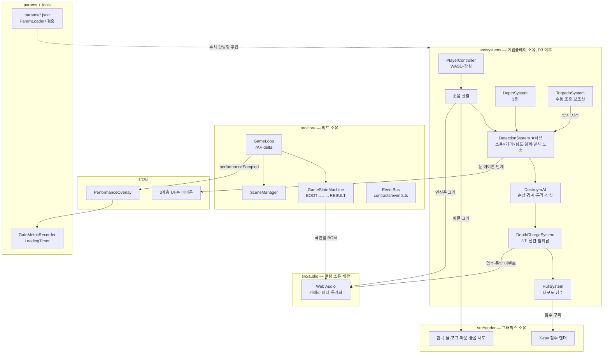

# ARCHITECTURE — 시스템 아키텍처

> 기준: `docs/deep_dive_master_plan.md` §7. 이 문서는 코드 관점 요약이다.

## 구성 요소

### 게임 루프 (`src/core/GameLoop.ts`)
`requestAnimationFrame` 기반. delta time(초)을 계산해 `update(dt)` →
`render()`를 분리 호출한다. 탭 복귀 등 프레임 튐은 0.1초로 클램프.
게임 규칙·렌더 내용은 모른다.

### 상태 머신 (`src/core/GameState.ts`, `GameStateMachine.ts`)
`BOOT → DEPARTURE → APPROACH → ATTACK → ESCAPE → RESULT (→ DEPARTURE)`.
허용 전환표(`STATE_TRANSITIONS`) 밖의 전환은 예외를 던진다. 전환 성공 시
`gameStateChanged` 이벤트 발행. 전환 **조건** 판정(게임 규칙)은 D6 이후
시스템들이 담당한다.

### EventBus (`src/core/EventBus.ts` + `src/contracts/events.ts`)
게임플레이·렌더·사운드·UI 간 유일한 통신 경로. 이벤트 이름·페이로드는
`GameEvents` 계약으로 타입 강제된다. 모듈 간 직접 import 참조 금지
(계약·core 제외).

### 시스템 계약 (`src/contracts/systems.ts`)
10개 인터페이스: PlayerController / DepthSystem / DetectionSystem /
AimSystem / TorpedoSystem / DepthChargeSystem / DestroyerAI / HullSystem /
AudioSystem / UISystem. 구현은 각 파트 소유 영역에서 한다 — D+5 기준
PlayerController·DepthSystem 구현 완료, 나머지는 D6 이후.
목록·소유자·입출력은 `docs/INTERFACES.md` 표 참조.

### 시스템 수명주기·등록 (`src/core/GameSystem.ts`, `SystemRegistry.ts`)
각 파트 구현체는 `GameSystem`(id / `initialize` / `update` / `render?` /
`dispose`)을 구현해 `SystemRegistry`에 등록된다. 호출 규약은 core가 보장한다:

- `initialize(context)` — 루프 시작 전 등록 순서대로 1회. `SystemContext`로
  `bus`(EventBus)·`params`(검증 완료 파라미터)·`stateMachine`을 공급받는다.
  그 외 의존성(렌더러 등)은 등록 지점에서 생성자 주입.
- `update(deltaSeconds)` — 매 프레임 등록 순서대로. 시뮬레이션만, 그리기 금지.
- `render()` — 매 프레임, SceneManager의 3D 장면 렌더 **후** 등록 순서대로.
  화면 표현이 있는 시스템(UI 등)만 선택 구현.
- `dispose()` — 루프 정지 시 등록 **역순** 1회. 구독 해제·자원 정리.

등록 중복 id·초기화 이후 등록·initializeAll 재호출은 예외로 거부한다.
시스템 내부 예외는 삼키지 않고 전파한다 (상태 머신과 동일 원칙).

## 시스템 실행 순서

**실행 순서 = 등록 순서**다. 우선순위 숫자·의존성 그래프는 도입하지 않는다.
유일한 등록 지점은 `Game.composeSystems()`이며, 그룹 순서는 다음을 지킨다:

1. **입력·조작** — PlayerController, DepthSystem, 카메라 (게임플레이, D3~D5)
2. **판정** — 탐지·어뢰·폭뢰·내구도 (게임플레이, D6 이후)
3. **AI** — DestroyerAI (리드, D6 이후)
4. **표현 연동** — 렌더 이펙트·UI·오디오 배관 (이벤트 구독 측)

프레임 전체 순서 (core/Game):
```
update:  registry.update(dt) → sceneManager.update(dt) → 성능 샘플링
render:  sceneManager.render()  [3D 장면] → registry.render()  [UI 계층]
```

`src/core`는 공통 보호 파일이므로 등록 배선 추가는 feat→dev 병합 시
리드가 수행한다. 각 파트는 자기 소유 영역에서 `GameSystem` 구현체를
export하고, CURRENT_STATUS의 자기 구역에 "등록 요청" 형태로 알리면 된다.

## 공통 공간·방향 규약 (`src/core/conventions.ts`)

D+5 플레이테스트 리뷰 후속 확정 (INT-CORE-002). 이동·카메라·프로펠러·UI·
어뢰는 축 방향을 추측하지 않고 이 파일의 상수·함수를 참조한다.

### 축·선수·선미 [확정]
- **잠수함 로컬 -Z = 선수(bow), 로컬 +Z = 선미(stern), 월드 +Y = 위.**
  코드 기준: `LOCAL_BOW` / `LOCAL_STERN` / `WORLD_UP`.
- `headingRadians`는 Y축(위) 기준 요(yaw). heading 0의 선수 방향은 월드
  (0, 0, -1). 렌더는 `meshYawRadians(heading)`(= heading 그대로)를
  `mesh.rotation.y`에 대입 — 모델은 로컬 -Z가 선수가 되도록 제작·임포트한다.
- **이동 방향 기준은 잠수함 로컬 축** — 카메라 기준이 아니다 (§3.3 확정).
  전진 벡터 = `bowDirectionXZ(heading)` = (-sin h, -cos h).

### 카메라 리센터 [확정]
Space 리센터 = **선미 뒤쪽 상단에서 선수 방향을 바라보는 후방 뷰.**
요 각 기준은 `cameraRecenterYawRadians(heading)`(= heading + π)이며,
CameraRig의 기존 후방 뷰 배치와 동일 정의다. 상단 높이·기본 피치는
렌더 소유 시각 구도 상수.

### 어뢰 생성 [확정]
어뢰는 **선수 방향에서 생성**된다 — 생성 방향은 `bowDirectionXZ(heading)`를
사용한다 (D6 TorpedoSystem 구현 시 적용). 선수 오프셋 거리는 구현 상수.

### 프로펠러 [확정]
- 배치: **선미**(`LOCAL_STERN`).
- 회전은 **실제 전후 속도값에만 연결**한다 — A/D 선회 단독 입력은 회전에
  영향을 주지 않는다. 회전 비율 계산은 `propellerSpinRatio(speed, maxSpeed,
  idleRatio)` 하나만 사용한다 (속도 외 입력을 받지 않는 시그니처로 강제).
- 정지 상태 공회전: 최대 회전의 8%가 기본값이며
  `params/movement.json propellerIdleSpinRatio`(FixedNumber, 0~1 검증)로
  외부 조정한다. 최대 회전 각속도(rad/s) 자체는 렌더 소유 연출 상수.
- 속도 소스: 렌더는 포즈 소스(`PlayerController.speed`)를 소비만 한다 —
  현재 `SubmarinePoseSource`(CanyonScene)는 position·heading만 포함하므로
  프로펠러 구현 시 `speed`를 Pick 목록에 추가해 소비한다 (판정 계산 금지).

## 조준 입력 단일화 (AimSystem)

마우스(우클릭)와 PC 화면 HUD 조준·발사 버튼은 **별도 전투 경로 없이 동일한
`AimSystem`**(contracts/systems.ts)을 호출한다 [D+5 리뷰 후속 소회의 확정]:

- 공용 진입점: `beginAim()`(잠망경 심도 아니면 false) / `endAim()` /
  `fireTorpedo()`(TorpedoSystem 위임). 읽기 상태 `aiming`.
- 입력 어댑터(마우스=게임플레이 입력, HUD 버튼=UI)는 composition root
  (`Game.composeSystems`)에서 같은 AimSystem 인스턴스를 주입받는다 —
  서로를 import하지 않는다.
- 조준 뷰 카메라 고정(§3.2)·UI 표시는 `aimModeChanged` 이벤트 구독으로
  처리한다 (렌더·UI가 게임플레이를 직접 참조하지 않음).
- 구현은 게임플레이 소유, D6 이후. 계약만 선확정해 마우스·HUD가 서로 다른
  방향으로 구현되는 것을 막는다.

## 게임 상태 전환과 장면 전환의 분리

- **게임 상태(국면)** — `GameStateMachine`이 소유. 전환은 허용표 검증 후
  `gameStateChanged` 이벤트 발행. 시스템은 `SystemContext.stateMachine`으로
  전환을 요청한다.
- **장면(Three.js 월드)** — `SceneManager`가 소유. 전환은 조립 수준에서
  `setActive()` 명시 호출로만 일어난다.

상태 전환이 장면 전환을 **자동으로 유발하지 않는다.** 버티컬 슬라이스는
협곡 단일 해역이므로 국면(BOOT→…→RESULT)이 바뀌어도 장면은 하나다 —
BGM·포그·UI 변화는 각 시스템이 `gameStateChanged`를 구독해 처리한다.
상태→장면 자동 매핑 계층은 필요 근거가 생기기 전까지 만들지 않는다.

## 핵심 설계 결정

### DetectionSystem이 시스템 허브다
소음·심도·엄폐·발사 노출을 입력받아 **단일 탐지 게이지**를 산출하고,
구축함 AI 상태 전이와 눈 아이콘 UI를 구동한다. D6~D9에는 임시 구현을
쓰되 인터페이스는 유지하며, D10~D12 본 구현 교체 시 내부만 바뀐다 [확정].

### 소음 값의 삼중 출력
소음 값 하나(`noiseChanged.level`)가 동시에 세 곳으로 분배된다:
① 탐지 게이지 입력 ② 파문 이펙트 크기(렌더) ③ 엔진음 크기(오디오).
시청각 일치 원칙의 구현점이며, 파문 이펙트는 보호 목록이다.

### 폭뢰 판정과 오디오 배관의 책임 분리
'풍덩→3초→폭발'의 **타이밍 주인은 판정 로직(DepthChargeSystem, 게임플레이
소유)**이다. 오디오(툴링 소유 배관)는 `depthChargeEnteredWater`/
`depthChargeExploded` 이벤트에 동기화만 하고, 지연 100ms+ 시 보상 오프셋을
적용한다. 보호 목록 '폭뢰 사운드 동기화'의 책임 경계.

### 파라미터는 단방향
`params/*.json` → `config/ParamLoader`(런타임 범위 검증) → 시스템 주입.
역방향(코드→JSON 기록) 금지. 기획이 params를 직접 커밋한다.
범위를 벗어난 값은 로드 시점에 `ParamValidationError`로 거부된다.

## 구조도



## 현재 실제 배선 (D+5 회색 박스 통합 기준)

`main.ts` → `Game`: 파라미터 로드·검증 → `Renderer`+`CanyonScene` 생성
(`ManagedScene`으로 SceneManager 등록) → 오버레이·계측 연결 →
`composeSystems(params, scene)` → `registry.initializeAll(context)` →
루프 시작 → 첫 렌더 시 `LoadingTimer` 기록 + `BOOT→DEPARTURE` 전환.

`composeSystems` 등록 순서 (실행 순서와 동일):

1. `gameplay` (`src/systems/GameplaySystems.ts`) — WASD 이동·관성 +
   Shift/Ctrl 심도 3층. initialize에서 window/document 입력 연결과 params
   핫리로드 구독(승인된 로더의 `onParamsReloaded` 주입), dispose에서 해제.
2. `cameraInput` (`src/render/CameraInputAdapter.ts`) — 마우스 궤도 회전·
   Space 리센터. 렌더 소유 카메라 입력 (D+5 책임 경계 확정).

구현체 간 직접 참조는 composition root에서만: `scene.attachPoseSource(
gameplay.poseSource)`로 읽기 전용 잠수함 포즈를 1회 주입한다. 렌더는
판정·이동을 계산하지 않고, 시스템 update 이후 sceneManager.update가
포즈를 소비한다. `WebAudioSystem`은 아직 미조립(후속 통합 항목 —
CURRENT_STATUS 빌드·툴 구역).
