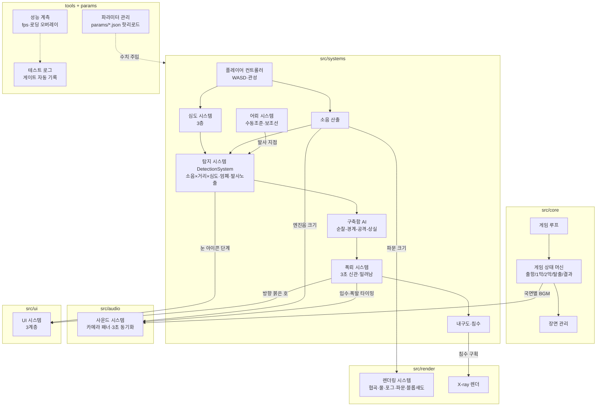

# 프로젝트 딥 다이브(가제) 통합 개발 마스터 플랜 — 버티컬 슬라이스 제작 및 검증 계획

---

# 1. 문서 개요

| 항목 | 내용 |
|---|---|
| 문서명 | 프로젝트 딥 다이브(가제) 통합 개발 마스터 플랜 — 버티컬 슬라이스 제작 및 검증 계획 |
| 버전 | v1.0 (2026-08-13) |
| 작성 목적 | 6회 회의(기획 3회, 그래픽 소회의 2회, 개발 소회의 1회)의 모든 결정을 단일 기준으로 통합하여, 15영업일 버티컬 슬라이스를 실제로 제작·관리·검증하기 위한 실행 문서 |
| 적용 범위 | 버티컬 슬라이스 제작 시작(D1)부터 게이트 리뷰(D+21)까지. 정식 제작 관련 내용은 §17에서 '후속 안건'으로만 분리 기술 |
| 문서 사용 대상 | 기획팀(게임·레벨 디자이너), 개발팀(리드·프로그래머 3인), 아트팀(그래픽 디자이너·아트팀장), 사운드팀, 경영진(CEO·디렉터) |
| 현재 프로젝트 단계 | 버티컬 슬라이스 제작 직전 (개발 착수 대기, D1 시작 준비 완료) |
| 기준 회의 | ① 1차 기획 대회의 ② 그래픽 방향 1차 소회의 ③ 풀 3D 전환 그래픽 소회의 ④ 버티컬 슬라이스 사양 확정 대회의(2차 대회의) ⑤ 실행 계획 확정 대회의(3차 대회의) ⑥ 개발팀 파트 분담·프로세스 소회의 |
| 최신 결정 적용 원칙 | 회의 간 결정이 충돌할 경우 **가장 최근 회의의 결정을 본문에 적용**한다. 변경 전 내용과 사유는 부록 B '주요 결정 변경 이력'에만 기록한다. 폐기된 안(2D, 2.5D, 사이드뷰, 자동 조준 우선 등)은 본문에서 확정 사양으로 다루지 않는다 |
| 문서 내 우선순위 | 충돌 시: **[보호 목록] > [게이트 기준] > [스코프 컷 테이블] > 일반 사양** 순으로 우선한다 |
| 표기 규칙 | **[확정]** = 번복 금지 또는 전원 합의 확정 / **[초기 테스트값]** = 튜닝표로 관리되는 조정 가능 수치 / **[검토 예정]** = 버티컬 슬라이스 통과 후 논의 항목 |

---

# 2. 프로젝트 비전과 목표

## 2.1 게임의 한 문장 정의 [확정]
> **UBOAT의 긴장감을, Submarine Attack의 즉각성으로, 바이브세일의 그래픽 비용으로 —**
> 브라우저에서 바로 실행되는 세션형(7~10분) 로우폴리 3D 잠수함 서바이벌 액션.

## 2.2 장르 및 플랫폼 [확정]
- **장르:** 세션형 잠수함 서바이벌 액션 (시뮬레이터가 아니라 '시뮬레이션의 감정')
- **플랫폼:** 웹 브라우저 (데스크톱 우선). 설치 없음, URL 접속 즉시 플레이
- **세션 구조:** 한 판 독립 완결, 판 간 영구 성장 없음

## 2.3 핵심 타깃 이용자
- 브라우저 캐주얼 게임 이용자 (fly.pieter, vibe.sailer, SilverGames류 이용층)
- UBOAT·사일런트 헌터에 흥미는 있으나 진입장벽·사양·시간 문제로 접근하지 못한 라이트 밀리터리 관심층
- 저사양 PC(내장그래픽 노트북) 사용자 — 사양 배제 없는 설계가 차별점

## 2.4 게임이 제공하려는 핵심 감정 [확정]
1. **은신의 긴장** — 소나 핑 간격이 빨라질 때의 압박, 숨을 참게 되는 침묵 항행
2. **국면 전환의 전율** — 어뢰를 쏘는 순간 사냥꾼에서 사냥감으로 바뀌는 감각
3. **소리로 살아남는 경험** — 화면 밖 폭뢰를 귀로 듣고 피하는 순간
4. **한 발의 손맛** — 리드샷을 직접 계산해 명중시키는 카타르시스 (아케이드식 과장 폭발)

## 2.5 기존 잠수함 게임과의 차별점
| 기존 | 딥 다이브 |
|---|---|
| 고사양 리얼리즘 그래픽 (UBOAT) | 로우폴리 플랫 셰이딩, 내장그래픽 60fps |
| 설치·긴 로딩 | 브라우저 접속 3초 |
| 밸브·승무원 미시 관리 | 승무원 = 스킬 버튼 4개, 심도 = 3층 버튼 |
| 수십 시간 캠페인 | 7~10분 세션 |
| 단순 슈팅 아케이드 (브라우저류) | 은신·발각·회피의 긴장 구조 보유 |

## 2.6 핵심 KPI [확정]
| KPI | 목표 | 측정 |
|---|---|---|
| 브라우저 접속 시간 | **3초 이내** (초기 다운로드 15MB 이하) | 계측 오버레이 자동 기록 (G2) |
| 첫 어뢰 발사 시간 | **60초 이내** (설명 없이, 테스터 5인 전원) | 게이트 리뷰 관찰 기록 (G3) |
| 목표 프레임 | **내장그래픽 노트북 60fps** (저사양 모드 허용) | 계측 오버레이 (G1) |
| 버티컬 슬라이스 플레이타임 | **목표 7분 / 상한 10분** (은신·회피 구간 가변) | 빌드 내 세션 타이머 로그 |

---

# 3. 최종 확정 게임 콘셉트

> 본 장은 **최종 확정안만** 기술한다. 2D 사이드뷰·2.5D 사이드스크롤 등 폐기안은 부록 B·C 참조.

## 3.1 최종 그래픽 방향 [확정 — 번복 금지 조항 발효]
- **로우폴리 + 플랫 셰이딩 풀 3D** (레퍼런스: 바이브세일)
- 물: 정점 애니메이션 + 심도별 그라데이션 포그. 반사·굴절 없음
- 그림자: 실시간 없음, 잠수함 아래 블롭 섀도만
- 공간 연출 문법: **연안·잠망경 심도는 밝고 채도 높게, 심해는 의도적으로 어둡고 비운 공포 연출** — '밝음→어둠' 대비가 공식 문법. 심해의 빈 화면은 결함이 아니라 의도
- 번복 금지: 게이트 통과 시 그래픽 방향 재론 금지. 게이트 미달 시에도 '로우폴리 풀 3D' 틀 안에서 최적화로 대응 (CEO 발의, 전원 동의)

## 3.2 카메라 방식 [확정]
- 자유 회전 3D 카메라 (마우스), 상하 ±60도 제한
- **Space = 리센터** (잠수함 후방 뷰 복귀) — 방향 상실 대응 필수 기능
- 어뢰 조준 중 카메라 자동 고정 (조준 뷰 전환) — 조준과 카메라 조작 분리
- 첫 판 한정 자동 카메라 모드 (자동 추적), 2판부터 자유 카메라 해금
- 사운드 패닝 기준은 **항상 카메라**

## 3.3 잠수함 조작 방식 [확정 + 초기 테스트값]
- WASD: W/S 전진·감속, A/D 선회 (**잠수함 방향 기준** — 카메라 기준 아님)
- 관성: UBOAT의 절반 수준 목표 — 정지 1.5초, 90도 선회 2.0초 [초기 테스트값, §11]
- 조작 철학: "묵직하지만 답답하지 않은" — 잠수함다움과 브라우저 즉각성의 절충점을 튜닝으로 탐색

## 3.4 심도 3층 구조 [확정]
| 층 | 이름 | 특성 |
|---|---|---|
| 1층 | 잠망경 심도 | 어뢰 조준 가능. 탐지 위험 최대 |
| 2층 | 순항 심도 | 표준 이동 층. 탐지 중간 |
| 3층 | 심해 은신 심도 | 탐지 최소, 폭뢰 회피 시간 +1초. **산소 압박** (90초 체류 시 경고 [초기 테스트값]) |

- Shift = 부상(한 층 위) / Ctrl = 잠항(한 층 아래). 연속 심도 아닌 층 단위 이동
- 4층 이상 확장 금지 (첫 플레이 학습 부담) — 3층 [확정]

## 3.5 협곡 해역의 역할 [확정]
- 버티컬 슬라이스 유일 해역. 선정 사유: 풀 3D 지형의 가치(다층 협곡)와 **지형 은신** 메커니즘을 동시에 검증하는 유일한 해역
- 좁은 협곡 = 시각 탐지 차단 엄폐물이자 이동 제약. 전경/배경 다층 지형 재배치로 에셋 재사용 (헝그리 샤크에서 가져온 지형 밀도 발상의 로우폴리 번역)
- 정식 제작 시 연안(심도 제한)·심해(산소 압박) 추가 예정 [검토 예정]

## 3.6 승무원 4명의 존재 방식 [확정]
- 관리 대상이 아니라 **스킬 버튼 4개 (1~4키)**: 함장(긴급 회피) / 소나수(적·폭뢰 표시) / 기관장(긴급 수리) / 어뢰수(신속 재장전)
- **스코프 가드 [확정]:** 영구 성장 없음, 부상·행동불능 없음, 판 내 강화만
- 존재 이유: "배 안에 사람이 산다"는 감각 — 스킬 사용·침수 시 X-ray로 가시화

## 3.7 X-ray 침수 연출 [확정 — 보호 목록]
- 장식이 아니라 **게임 정보**: 침수 발생 시 자동 발동, 해당 구획의 수위 상승이 반투명 선체 너머로 보임
- 1순위 = 침수 가시화 (컷 불가) / 2순위 = 승무원 미니어처 모션 (버티컬 슬라이스에서는 구획 아이콘 점멸로 대체 [확정])
- 기술 검증: 1주차 렌더링 스파이크 (남유리). 실패 시 아이콘 점멸 UI로 대체, 오세진에게 0.5일 이관 [확정된 대체 경로]

## 3.8 사운드 = 1차 정보 원칙 [확정]
- 게임플레이의 핵심 정보는 소리가 먼저 전달한다: 소나 핑 간격(적 접근도), 폭뢰 입수음(방향+3초 카운트다운), 엔진음(자기 소음), 침묵 항행(BGM 제거+심장박동)
- 소리를 켠 유저가 명확히 유리한 구조 [확정 — 1차 본회의 중재안]
- 모노 환경(노트북 스피커) 대응: 방향 정보는 스테레오 패닝 + **모노에서도 살아남는 정보(핑 간격·음높이 변화)** 이중화

## 3.9 시각 = 축약된 2차 정보 원칙 [확정]
- 시각 정보는 사운드의 축약 백업: 정확한 타이밍은 소리, 화면은 대략적 경고만
- 음소거 유저도 플레이는 가능하되 불리한 구조 (배려 상한선 [확정])
- 소음 수치는 숫자 UI 금지 — **잠수함 주변 동심원 파문 이펙트**(엔진음 크기와 동기화)로 월드에 표현 [보호 목록]

---

# 4. 핵심 플레이 루프

전체 흐름: **출항 → 화물선 탐지 → 지형·심도 은신 → 어뢰 조준·발사 → 발사 지점 노출 → 구축함 출현·추격 → 폭뢰 회피 → 탈출 지점 도달**

## 4.1 출항
| 항목 | 내용 |
|---|---|
| 플레이어 목표 | 조작 감각 습득, 협곡 진입 |
| 사용 기능 | WASD 이동, Shift/Ctrl 심도, 카메라(첫 판 자동) |
| 적 반응 | 없음 (안전 구간) |
| 성공 조건 | 협곡 입구 통과 |
| 실패 가능성 | 없음 (지형 충돌 대미지 없음 구간) |
| UI | 상시 계층만 (심도 게이지·어뢰·내구도·쿨다운) |
| 사운드 | 엔진음(속도 연동), 잔잔한 BGM |
| 다음 단계 조건 | 화물선이 소나 탐지 범위에 진입 |

## 4.2 화물선 탐지
| 항목 | 내용 |
|---|---|
| 플레이어 목표 | 화물선 위치·진행 방향 파악 |
| 사용 기능 | 소나수 스킬(2키, 위치 5초 표시), 잠망경 심도 부상 |
| 적 반응 | 화물선은 일정 경로 항행 (플레이어 미인지) |
| 성공 조건 | 화물선 시야 확보 |
| 실패 가능성 | 고속 접근 시 소음 파문 확대 → 호위 구축함 조기 경계 진입 가능 |
| UI | 눈 아이콘 등장 조건 충족 시 표시 시작 |
| 사운드 | 화물선 스크류음(거리·방향 패닝) |
| 다음 단계 조건 | 어뢰 사거리 진입 |

## 4.3 지형·심도를 활용한 은신 접근
| 항목 | 내용 |
|---|---|
| 플레이어 목표 | 탐지 게이지를 채우지 않고 사격 위치 도달 |
| 사용 기능 | 저속 항행, 지형 엄폐(시각 탐지 차단), 심도 하강(탐지 감소), 침묵 항행(C) |
| 적 반응 | 구축함 순찰 상태 — 소음×거리×심도로 탐지 게이지 충전 |
| 성공 조건 | 미발각 상태로 잠망경 심도 사격 위치 도달 |
| 실패 가능성 | 게이지 만충 → 조기 발각 → 4.6으로 강제 점프(공격 기회 상실) |
| UI | 눈 아이콘(비어 있음→노란 반개), 소음 파문 |
| 사운드 | 구축함 소나 핑(간격=거리), 자기 엔진음 |
| 다음 단계 조건 | 잠망경 심도 + 우클릭 조준 개시 |

## 4.4 어뢰 조준·발사
| 항목 | 내용 |
|---|---|
| 플레이어 목표 | 리드샷 계산, 화물선 명중 |
| 사용 기능 | 수동 조준 + 리드샷 보조선 [확정 — 자동 락온은 보험], 어뢰 발사(3발 보유) |
| 적 반응 | 발사 전까지 무반응 |
| 성공 조건 | 화물선 1발 명중 = 격침 |
| 실패 가능성 | 빗나감 (재장전 20초 [초기 테스트값], 잔여 어뢰 소모) |
| UI | 조준 뷰(카메라 고정), 보조선, 어뢰 잔량 |
| 사운드 | 발사음, 어뢰 스크류음 멀어짐, 명중 시 아케이드식 과장 폭발음 [확정] |
| 다음 단계 조건 | 발사 즉시 4.5 발동 (명중 여부 무관) |

## 4.5 발사 지점 노출 (국면 전환)
| 항목 | 내용 |
|---|---|
| 규칙 [확정] | 어뢰 발사 시 **발사한 그 지점**이 구축함의 '마지막 목격 위치'로 무조건 기록 |
| 플레이어 목표 | 발사 지점에서 즉시 이탈 |
| 사용 기능 | 이동, 심도 하강, 지형 엄폐 |
| 적 반응 | 구축함 → 경계 상태 진입 (목격 지점으로 이동 + 소나 핑) |
| 설계 의도 | '사냥꾼→사냥감' 국면 전환을 100% 보장하되(2막 스킵 방지), 노출은 지점이지 현재 위치가 아니므로 숙련 여지 유지 |
| 사운드 | BGM 전환 (2막 시작 — 발각은 실패가 아니라 국면 전환) |
| 다음 단계 조건 | 구축함이 경계 상태로 접근 개시 |

## 4.6 구축함 출현·추격
| 항목 | 내용 |
|---|---|
| 플레이어 목표 | 재발각 회피, 폭뢰 사거리 밖 유지 |
| 사용 기능 | 침묵 항행, 심해 층, 지형 엄폐, 함장 스킬(긴급 회피) |
| 적 반응 | 경계: 목격 지점+진행 방향 직선 연장 수색, 핑 가속 / 발각 시: 공격 상태 진입 |
| 성공 조건 | 게이지 하강 → 구축함 상실 상태 → 탈출 기회 |
| 실패 가능성 | 재발각 → 4.7 폭뢰 국면 |
| UI | 눈 아이콘 (노란→빨간), 소음 파문 |
| 사운드 | 핑 간격 가속(1차 정보), 구축함 스크류음 접근 |
| 다음 단계 조건 | 발각 유지 시 폭뢰 투하 개시 / 은신 성공 시 4.8로 직행 가능 |

## 4.7 폭뢰 회피
| 항목 | 내용 |
|---|---|
| 플레이어 목표 | 폭뢰 폭발 반경 이탈, 내구도 보존 |
| 사용 기능 | 회피 기동, 심해 층(회피 시간 +1초), 함장·기관장 스킬 |
| 적 반응 | 공격 상태 — 예상 위치 통과하며 폭뢰 투하 (동시 최대 6개 [성능 예산]) |
| 규칙 [확정] | **풍덩(방향 패닝 입수음) → 3초 → 폭발.** 화면 밖 폭뢰도 소리만으로 회피 가능. 신관 하한 3.0초 고정(인간 반응 사슬 1.8초+관성 근거). 난이도는 신관이 아니라 동시 폭뢰 수로 조절 |
| 피해 | 직격 = 대미지 대 + 침수(X-ray 자동 발동) / 근접 = 대미지 소 + 밀려남 8m [초기 테스트값] + 카메라 흔들림 |
| 실패 가능성 | 내구도 0 = 패배 (유일한 실패 조건 [확정]) |
| UI | 가장자리 붉은 호(대략 방향만), 폭발 직전 0.5초 화면 흔들림, 침수 X-ray |
| 사운드 | 입수음 패닝, 폭발 직전 고주파 상승음, 침수 물소리 |
| 다음 단계 조건 | 구축함 상실 상태 진입 (일정 시간 미탐지) |

## 4.8 탈출 지점 도달 (클리어)
| 항목 | 내용 |
|---|---|
| 플레이어 목표 | 탈출 지점 도달 |
| 사용 기능 | 이동, 잔여 스킬, Tab(탈출 방향 확인) |
| 적 반응 | 상실 상태 — 수색 범위 확대 후 순찰 복귀 |
| 성공 조건 | **화물선 격침 + 탈출 지점 도달** = 클리어 [확정] |
| 실패 가능성 | 탈출 중 재발각 → 4.6 루프 재진입 (플레이타임 가변 구간 — 시간 증가 자체가 페널티) |
| UI | Tab 시 탈출 방향, 결과 화면(격침·소요 시간·피격 횟수) |
| 사운드 | 긴장 해소 BGM 전환 |
| 종료 | 결과 화면 → 재시작 (판 간 지속 요소 없음) |

---

# 5. 주요 게임 시스템 상세 사양

> 공통 표기: 각 시스템에 목적 / 규칙 / 관계 / 수치([초기 테스트값]·범위·판단 기준) / 담당 / VS(버티컬 슬라이스) 필수 여부를 기재한다. 수치의 변경 이력 관리는 §11 프로세스를 따른다.

### 5.1 잠수함 이동과 관성
- **목적:** '육중한 잠수함다움'(UBOAT 계승)과 브라우저 즉각성의 절충
- **규칙:** W/S 가감속, 속도는 소음과 직결(5.4). 정지·선회에 관성 적용
- **관계:** 소음 시스템(속도→소음), 폭뢰 회피(관성이 회피 난이도 결정), 신관 하한 3.0초의 근거
- **수치:** 정지 관성 1.5초 [0.5~2.0] — "조작이 씹힌다" 2인+ → 감소 / "잠수함 같지 않다" 2인+ → 증가
- **담당:** 수치 박태현 / 구현 오세진 | **VS 필수:** 예

### 5.2 선회와 카메라
- **목적:** 3D 공간 방향 인지 유지, 조작-시점 분리
- **규칙:** A/D 선회는 잠수함 기준. 카메라 마우스 자유 회전 ±60도, Space 리센터, 조준 중 고정, 첫 판 자동 카메라
- **관계:** 사운드 패닝 기준(카메라), 게이트 G5(방향 상실·멀미)
- **수치:** 90도 선회 2.0초 [1.0~3.0] — G7 미달 시 감소
- **담당:** 수치 박태현 / 구현 오세진 | **VS 필수:** 예

### 5.3 심도 전환
- **목적:** 3D 수직 공간을 '이해 가능한 의사결정'으로 압축 (풀 6자유도 금지 [확정])
- **규칙:** 3층(잠망경/순항/심해) 층 단위 이동, Shift/Ctrl. 잠망경 심도에서만 조준 가능. 심해는 탐지 감소+회피 +1초+산소 압박
- **관계:** 탐지 보정(5.6), 폭뢰 회피(4.7), 산소(심해 90초 경고 [60~120] — 심해 미사용 시 완화/캠핑 시 강화, 담당 최윤아)
- **담당:** 구현 오세진 | **VS 필수:** 예

### 5.4 은신과 소음
- **목적:** '언제 움직이고 언제 숨을지'의 판단 게임 성립
- **규칙:** 소음 증가 = 고속 이동(대)·어뢰 발사(지점 노출)·능동 소나(대, 일시) / 감소 = 저속·심해·엄폐. 소음은 숫자 UI 없이 **월드 파문 이펙트**로 가시화 [보호 목록], 파문 크기와 엔진음 동기화
- **관계:** 탐지 게이지 입력값, 파문 렌더(남유리)-사운드(이준호) 동기화
- **담당:** 수치 박태현 / 판정 오세진 / 파문 남유리 | **VS 필수:** 예

### 5.5 지형 엄폐
- **목적:** 협곡 해역의 존재 이유 — 지형을 전술 자원으로
- **규칙:** 지형이 구축함 시선을 막으면 **시각 탐지 완전 정지**. 음향 탐지(능동 소나)는 감소만 (소리는 지형을 돌아감)
- **관계:** 탐지 게이지(5.6), 레벨 블록아웃의 엄폐 지점 3곳+ (최윤아 DoD)
- **담당:** 판정 오세진 / 배치 최윤아 | **VS 필수:** 예

### 5.6 탐지 게이지
- **목적:** 은신 상태를 단일 지표로 통합 (복수 게이지 금지 — 탈시뮬레이터)
- **규칙:** 충전 속도 = 소음 × 거리 × 심도 보정. 만충 = 발각. UI는 눈 아이콘 3단계(비움=안전/노란 반개=수색/빨간 개안=발각)
- **관계:** 모든 은신 요소의 출력 통합점, AI 상태 전이 트리거
- **수치:** 잠망경 심도 기준 만충 8초 [5~15] — G6 미달 → 증가 / 긴장 부족 응답 → 감소
- **담당:** 수치 박태현 / 구현 오세진 | **VS 필수:** 예

### 5.7 침묵 항행
- **목적:** 1차 본회의 시그니처 연출('숨 참기')의 시스템화
- **규칙:** 토글 C. 이동 불가, 소음 최소, 배터리 미소모·산소만 소모. 발동 시 BGM 제거+심장박동, 조명 감쇠+UI 최소화
- **관계:** 소음(5.4) 최저치 진입 수단, 사운드 연출(이준호)
- **담당:** 구현 오세진 / 연출 이준호·남유리 | **VS 필수:** 예

### 5.8 어뢰 수동 조준과 리드샷 보조선
- **목적:** 코어 3요소 중 '어뢰의 손맛' — 검증 대상 그 자체
- **규칙 [확정 — 우선순위 역전]:** **수동 조준 + 리드샷 보조선이 기본.** 자동 락온·3단계 페이드아웃은 60초 게이트(G3) 위험 시에만 투입하는 보험 (스텁 금지, §13). 우클릭 = 조준 뷰(카메라 고정), 보조선은 적 속도 기반 리드 지점 표시
- **관계:** G3 게이트, 발사 시 5.10 무조건 발동
- **수치:** 재장전 20초 [10~30] — 대기 중 이탈 행동 관측 시 감소. 보유 3발
- **담당:** 수치 박태현 / 구현 오세진 | **VS 필수:** 예 (자동 락온은 아니오)

### 5.9 화물선 격침
- **목적:** 1막의 목표, 명중 카타르시스 제공
- **규칙:** 화물선 1종, 일정 경로 항행, 1발 격침. 명중음은 아케이드식 과장 [확정]. 격침 보상: 어뢰 +1 고정 지급 (강화 카드 컷의 대체 [확정])
- **관계:** 클리어 조건의 전반부, 4.5 국면 전환 트리거
- **담당:** 오세진 / 모델 한도윤 | **VS 필수:** 예

### 5.10 어뢰 발사 지점 노출
- **목적:** '사냥꾼→사냥감' 국면 전환 100% 보장 (2막 스킵 방지 [확정])
- **규칙:** 발사 순간 발사 지점이 구축함 '마지막 목격 위치'로 기록. 현재 위치가 아님 — 즉시 이탈 시 추적을 벗어날 여지
- **관계:** 구축함 AI 경계 상태 트리거, 은신 시스템의 유일한 '무조건 노출' 예외
- **담당:** 오세진 (DetectionSystem 내) | **VS 필수:** 예

### 5.11 구축함 AI
- **목적:** 2막의 위협 — 예측 불가하되 이해 가능한 사냥꾼
- **규칙:** 상태 기계 — 순찰 → 경계(마지막 목격 위치+진행 방향 직선 연장, 핑 가속) → 공격(예상 위치 통과+폭뢰 투하) → 상실(수색 확대 후 순찰 복귀). **VS는 경계·공격 2상태 우선 구현** [확정 — 구현 깎기], 예측 이동 AI는 정식 제작 이월 [검토 예정]. VS에서 구축함은 무적 (격침 컷)
- **관계:** 탐지 게이지가 상태 전이 입력, 폭뢰 시스템 호출
- **담당:** 정하늘 | **VS 필수:** 예 (2상태)

### 5.12 폭뢰 투하와 3초 신관
- **목적:** 게임의 시그니처 리듬 — '풍덩 → 3초 → 폭발'을 소리로 피하는 경험
- **규칙:** 입수음(방향 패닝) 후 3.0초 뒤 폭발. **신관 하한 3.0초 고정 [확정 — 인간 반응 사슬 1.8초 + 관성 1.5초 근거].** 난이도는 동시 폭뢰 수 [2~6]로 조절. 화면 밖 폭뢰도 소리만으로 회피 가능 (G7 세부 조건). 심해 층 회피 시간 +1초
- **관계:** 사운드 동기화 [보호 목록], 오디오 배관(임찬영)-판정(오세진) 경계
- **수치:** 신관 3.0초 [3.0~4.0] — 소리 회피 0/5 → 증가 / 시시함 3인+ → 폭뢰 수로 조절 (담당 이준호)
- **담당:** 판정 오세진 / 배관 임찬영 / 수치 이준호 | **VS 필수:** 예

### 5.13 직격 및 근접 폭발
- **목적:** 피해의 물리적 실감 (UBOAT 계승)
- **규칙:** 직격 = 대미지 대 + 침수 발생 / 근접 = 대미지 소 + 밀려남 + 카메라 흔들림(VS는 단일 강도 [확정 — 세부 흔들림 컷])
- **수치:** 밀려남 8m [4~15] — '억울한 지형 충돌사' 2인+ → 감소 (담당 정하늘)
- **관계:** 내구도(5.14), X-ray(5.17), 자체 간이 물리(밀려남 벡터)
- **담당:** 오세진·정하늘 | **VS 필수:** 예

### 5.14 내구도와 침수
- **목적:** 단일 실패 조건의 명료함
- **규칙:** 실패 = **내구도 0 단일** [확정]. 침수 = 지속 대미지 + X-ray 자동 발동, 기관장 스킬로 복구. 산소는 심해 층 압박 요소일 뿐 단독 사망 조건 아님 [확정]
- **관계:** G8(실패 원인 이해) 게이트의 대상
- **담당:** 오세진 | **VS 필수:** 예

### 5.15 탈출 및 클리어
- **목적:** '공격 후 도주'라는 잠수함 게임 후반 긴장의 보존
- **규칙:** 클리어 = 화물선 격침 **그리고** 탈출 지점 도달. 격침만으로는 미완. 탈출 중 재발각 시 추격 루프 재진입 (플레이타임 7→10분 가변의 원천)
- **담당:** 정하늘 (상태 머신) | **VS 필수:** 예

### 5.16 승무원 스킬
- **목적:** '배 안에 사람이 산다'의 게임화 (관리 아닌 스킬)
- **규칙:** 1함장(3초 선회·속도 증가) / 2소나수(적·폭뢰 5초 표시) / 3기관장(침수·손상 수리) / 4어뢰수(재장전 20→8초 [→5~12, 사용률 0%면 폭 확대]). 쿨다운 45~90초 [초기 테스트값]. 부상·성장 없음 [스코프 가드]
- **담당:** 수치 박태현 / 구현 오세진 | **VS 필수:** 예 (스킬 4종) / 이동 애니메이션은 아니오 (아이콘 점멸 대체)

### 5.17 X-ray 내부 정보
- **목적:** 침수·수리를 '보이는 정보'로 (UBOAT의 내부 실감) [보호 목록]
- **규칙:** 침수 시 자동 발동 — 선체 반투명 + 구획 수위 상승 가시화. 승무원은 구획 아이콘 점멸 (모션은 컷). 1주차 렌더 스파이크로 기술 검증, 실패 시 아이콘 UI 대체 (이관 경로 확정)
- **담당:** 남유리 (스파이크·렌더) / 사양 김세라 | **VS 필수:** 예 (침수 표시)

### 5.18 UI 표시 우선순위
- **목적:** 시뮬레이터화 방지 — 정보의 계층화
- **규칙 [확정]:** 3계층 — ① 상시(모서리 소형): 심도 3칸·어뢰·내구도·쿨다운 ② 위험 시(중앙 강조): 눈 아이콘·폭뢰 붉은 호·침수 X-ray·산소(심해만) ③ Tab: 탈출 방향·상세. VS는 상시+폭뢰 경고 우선 구현 [확정 — 구현 깎기]
- **담당:** 오세진 | **VS 필수:** 예 (최소 UI)

### 5.19 사운드와 시각 정보의 역할 분담
- **목적:** '소리로 살아남는 게임'의 사양화
- **규칙 [확정 — 7행 사양표]:**

| 상황 | 사운드 (1차) | 시각 (2차) |
|---|---|---|
| 적 소나 접근 | 핑 간격 가속 | 눈 아이콘 (수색) |
| 폭뢰 투하 | 방향 패닝 입수음 | 가장자리 붉은 호 |
| 폭발 직전 | 고주파 상승음 | 화면 흔들림 (0.5초 전) |
| 침수 | 물소리 + 경고음 | X-ray 자동 발동 |
| 침묵 항행 | BGM 제거, 심장박동 | 조명 감쇠 + UI 최소화 |
| 자기 소음 | 엔진음 크기 | 월드 파문 |
| 어뢰 주행 | 스크류음 멀어짐 | 항적 거품 라인 |

- 패닝 기준 = 카메라. 모노 생존 정보(간격·음높이) 병행. 테스터 2인+ 노트북 스피커 조건
- **담당:** 이준호 (세트+모노 검증 리포트) / 연동 임찬영 | **VS 필수:** 예 (핵심 사운드)

---

# 6. 버티컬 슬라이스 범위

## 6.1 검증 목적 정의
버티컬 슬라이스는 콘텐츠 분량이 아니라 **다음 4가지 질문에 답하기 위한 빌드**다:
1. 저사양 브라우저에서 이 게임이 기술적으로 성립하는가 (G1·G2)
2. 설명 없이 60초 안에 배울 수 있는가 (G3~G5)
3. 은신과 폭뢰 회피가 '재미'인가 (G6~G9)
4. 정식 제작에 리소스를 태울 가치가 있는가 (4문 투표)

## 6.2 포함 범위 [확정]
협곡 해역 1개 / 잠수함 이동·관성·심도 3층 / 화물선 1척(1발 격침) / 구축함 1척(무적, AI 2상태) / 어뢰 전투(수동 조준+보조선, 3발) / 탐지·은신(게이지·엄폐·파문·발사 노출·침묵 항행) / 폭뢰 회피(3초 신관·소리 회피) / 내구도·침수·실패 / 탈출·클리어 / 최소 UI(상시+폭뢰 경고) / 핵심 사운드(7행 사양표) / X-ray 침수 표시 / 저사양 성능 계측(fps·로딩 오버레이)

## 6.3 제외 범위 [확정]
영구 성장 / 멀티플레이 / 3택 1 강화 카드 / 승무원 이동 애니메이션 / 구축함 격침 / 자동 조준·페이드아웃 / 복잡한 카메라 흔들림 / 어군·장식 오브젝트 / 추가 해역(연안·심해) / 라이브 서비스 기능(데일리 챌린지, 수익화 등)

## 6.4 스텁 금지 원칙 [확정]
> 제외 항목은 코드에 **자리(스텁)·빈 구조·'나중을 위한 인터페이스'조차 만들지 않는다.** "나중에 넣기 쉽게 미리"가 공수를 먹는다. 유일한 예외: 인스턴싱 렌더 경로 — 파문 이펙트에 쓰이는 **공용 기술**이므로 존재하되, 어군 '콘텐츠'는 만들지 않는다 (개발팀 소회의 예외 기록).

---

# 7. 기술 스택과 시스템 아키텍처

## 7.1 기술 스택 [확정]
| 영역 | 선택 | 사유 |
|---|---|---|
| 렌더링 | **Three.js** | 로우폴리·무그림자·무반사 방향이라 엔진 기성품 가치 낮음. 저장 즉시 리로드되는 이터레이션 속도. 바이브세일 실증 |
| 빌드 | **Vite** | 개발 서버 속도, 트리 셰이킹으로 용량 절감 |
| 언어 | **TypeScript** | 시스템 간 인터페이스 명세(DetectionSystem 등) 강제 |
| 물리 | **자체 간이 물리** (구 충돌 + 밀려남 벡터) | 풀 물리엔진 불필요 — 필요한 건 충돌·밀려남뿐 |
| 오디오 | **Web Audio API** (카메라 기준 패너) | 3D 패닝 + 지연 측정 가능 |
| 파라미터 | **JSON 외부 파일** (핫리로드) | 하드코딩 금지 [확정], 기획 직접 커밋 |
| 배포 | **정적 호스팅 + CDN** | 서버 없음, 접속 3초 |
| 저장소 | **GitHub 단일 리포** | §10 규칙 |

(기각: Unity WebGL — 초기 용량이 15MB 게이트와 충돌, WebGL 빌드 이터레이션 저속. 부록 C)

## 7.2 시스템 구조와 데이터 흐름



**핵심 의존 관계 요약:**
- **DetectionSystem이 허브:** 소음·심도·엄폐·발사 노출을 입력받아 탐지 게이지를 산출하고, AI 상태 전이와 눈 아이콘을 구동. 2단계에서 임시 구현하되 인터페이스 분리 의무 [확정] — 3단계에서 본 구현으로 교체 시 내부만 교체
- **소음의 삼중 출력:** 소음 값 하나가 ① 탐지 입력 ② 파문 크기(렌더) ③ 엔진음 크기(오디오)로 동시 분배 — 시청각 일치 원칙의 구현점
- **폭뢰의 시간 축:** 판정 로직(오세진 소유)이 타이밍의 주인, 사운드 시스템(임찬영 배관)은 지연 측정 기반으로 동기화 — [보호 목록] '폭뢰 사운드 동기화'의 책임 경계
- **파라미터는 단방향:** JSON → 시스템 주입만 허용. 코드→JSON 역기록 금지. 기획(박태현)이 params 직접 커밋

---

# 8. 개발 단계별 전체 일정 (D1~D15)

> 원칙 [확정]: **그래픽보다 조작이 먼저, 조작보다 계측이 먼저.** 각 단계는 Exit Criteria로만 완료 판정. 주간 빌드 D+5 / D+10 / D+15.

## 단계 0: 환경 구축 — D1~D2
| 항목 | 내용 |
|---|---|
| 기간 | D1~D2 |
| 작업 | Three.js+Vite+TS 프로젝트 생성 / 저장소·브랜치·파일 구조(§10) / 정적 배포 파이프라인 / **fps·로딩 계측 오버레이** / JSON 핫리로드 툴 골격 / 빈 씬 배포 |
| 담당 | 임찬영 (주도), 정하늘 (구조 검수) |
| 선행 | 없음 |
| 산출물 | 배포 URL, 계측 오버레이, 리포 초기 구조 |
| 완료 조건 | 빈 씬이 URL로 접속되고 fps·로딩 시간이 화면에 표시됨 |
| 실패 시 대응 | D2 저녁까지 미완 → 배포 자동화를 수동 배포로 강등, D+5 빌드 전 재자동화 |
| 다음 진입 조건 | 계측 오버레이 작동 확인 (정하늘 승인) |

## 단계 1: 회색 박스 — D3~D5
| 항목 | 내용 |
|---|---|
| 기간 | D3~D5 |
| 작업 | 캡슐 잠수함: 이동+관성 / 선회(잠수함 기준) / 심도 3층 전환 / 카메라 회전·리센터·±60도 / 회색 협곡 블록아웃 통과 (최윤아 D+5 블록아웃 수신·배치) |
| 담당 | 오세진 (조작·심도·카메라), 최윤아 (블록아웃), 정하늘 (상태 머신 골격) |
| 선행 | 단계 0 완료, 박태현 수치표 JSON (D+3 절대 마감) |
| 산출물 | **D+5 빌드 = 회색 박스** (전사 공유) |
| 완료 조건 | 팀 전원이 브라우저에서 조작 테스트, 관성 1차 튜닝 완료 |
| 실패 시 대응 | 수치표 지연(R-D2) → 임시 기본값 선진행, 책임은 지연 측 / 조작 미완 → 카메라 기능 축소(자동 카메라만) 후 계속 |
| 다음 진입 조건 | D+5 빌드 리뷰에서 "조작이 씹힌다" 2인 미만 (§11 판단 기준 1차 적용) |

## 단계 2: 코어 전투 루프 — D6~D9
| 항목 | 내용 |
|---|---|
| 기간 | D6~D9 |
| 작업 | 화물선 배치·경로 / **임시 탐지(인터페이스 분리 의무)** / 수동 조준+리드샷 보조선 / 어뢰 발사·명중·격침 / 구축함 등장(경계·공격 2상태) / 폭뢰 투하·3초 신관·피해 / 탈출 지점·클리어·실패 |
| 담당 | 오세진 (조준·어뢰·폭뢰 판정), 정하늘 (AI·상태 머신·통합) |
| 선행 | 단계 1 완료 |
| 산출물 | 처음부터 끝까지 도는 '최초의 게임' |
| 완료 조건 | 죽지 않고 1회 클리어 가능 (출항→격침→회피→탈출 전 구간) |
| 실패 시 대응 | **R-D3 (D9 미완):** 즉시 디렉터 보고 + 비상 컷 발동 — 3단계 은신을 '소음+눈 아이콘'만으로 축소. 발동 권한 개발 리드 단독 [확정] |
| 다음 진입 조건 | 코어 루프 1회 완주 시연 (정하늘 판정) |

## 단계 3: 은신·탐지 — D10~D12
| 항목 | 내용 |
|---|---|
| 기간 | D10~D12 |
| 작업 | DetectionSystem 본 구현 교체: 속도 연동 소음 / 소음 파문 이펙트(남유리) / 지형 엄폐(시각 차단·음향 감소) / 심도별 보정 / 어뢰 발사 지점 노출 / 침묵 항행(C) / 눈 아이콘 3단계 UI |
| 담당 | 오세진 (탐지 본체), 남유리 (파문), 정하늘 (AI 연동) |
| 선행 | 단계 2 완료 (임시 탐지 인터페이스 존재) |
| 산출물 | **D+10 빌드 = 코어 전투 + 은신 일부** (전사 공유) |
| 완료 조건 | '은신 클리어'와 '들켜서 도주 클리어' 두 플레이 스타일 모두 성립 |
| 실패 시 대응 | 비상 컷 발동 상태면 소음+눈 아이콘만 / 파문 지연 → 임시 링 이펙트로 대체 후 4단계에서 품질화 |
| 다음 진입 조건 | 두 스타일 클리어 시연 + D+10 빌드 리뷰 통과 |

## 단계 4: 연출 적용 — D13~D14
| 항목 | 내용 |
|---|---|
| 기간 | D13~D14 |
| 작업 | 로우폴리 모델 3종 교체(한도윤 D+8 산출물) / 심도별 포그·조명(태양광+겸용 1) / 폭뢰 입수·폭발 사운드 3초 동기화(이준호 D+10 세트) / X-ray 침수(스파이크 결과 반영) / 최소 UI(상시+폭뢰 경고) / 엔진음·소나음 연동 |
| 담당 | 남유리 (모델 교체·포그·조명·X-ray), 임찬영 (사운드 배관·동기화), 오세진 (UI) |
| 선행 | 단계 3 완료, 모델 D+8, 사운드 D+10, X-ray 사양(김세라) |
| 산출물 | 보호 목록 4종 작동 빌드 |
| 완료 조건 | **[보호 목록] 60fps·폭뢰 동기화·X-ray 침수·파문 전부 작동** |
| 실패 시 대응 | 모델 지연 → 회색 박스 유지 채로 게이트行 (게이트에 아트 항목 없음) / X-ray 스파이크 실패 → 아이콘 점멸 대체(오세진 0.5일 이관) [확정 경로] |
| 다음 진입 조건 | 보호 목록 체크 4/4 (김세라·이준호 각자 항목 검수) |

## 단계 5: 통합·게이트 준비 — D15
| 항목 | 내용 |
|---|---|
| 기간 | D15 |
| 작업 | 최적화(성능 예산 §12 대조) / 저사양 모드(희생 순서 적용) / 심각도 상위 버그 수정 / **빌드 봉인** / G1·G2 자체 측정·기록 |
| 담당 | 전원 (주도 정하늘·임찬영) |
| 선행 | 단계 4 완료 |
| 산출물 | **D+15 빌드 = 게이트 제출본** (이후 수정 금지) |
| 완료 조건 | G1(60fps)·G2(3초·15MB) 자체 측정 통과 |
| 실패 시 대응 | G1 미달 → 희생 순서 ①~④ 순차 적용 / G2 용량 초과 → 사운드 스트리밍 분리 확대, 텍스처 재압축 |
| 다음 진입 조건 | 봉인 선언 (정하늘) → D+16~20 테스터 세션 → D+21 게이트 리뷰 |

**D+16~D+20 (개발 외 트랙):** 테스터 5인 세션 진행 (서지우 주관, 관찰 기록·인터뷰 원문 작성. 2인+ 노트북 스피커). 강민준 — 테스터·장비 D+12까지 확보 완료 상태여야 함.

---

# 9. 조직 구성과 역할 분담

## 9.1 전체 조직도
- **경영·총괄:** CEO 강민준 / 디렉터 서지우
- **기획:** 게임 디자이너 박태현 / 레벨 디자이너 최윤아
- **아트:** 그래픽 디자이너 한도윤 / 아트팀장 김세라
- **사운드:** 사운드 디자이너 이준호
- **개발:** 개발 리드 정하늘 / 게임플레이 프로그래머 오세진 / 그래픽스 프로그래머 남유리 / 빌드·툴 담당 임찬영

## 9.2 역할별 상세표

| 역할 | 담당 업무 | 핵심 산출물 | 완료 조건 | 마감 | 선행 의존 | 후속 의존 | 대체 담당 |
|---|---|---|---|---|---|---|---|
| CEO 강민준 | 리소스·대외·최종 경영 판단 | 테스터 5인 섭외, 내장그래픽 노트북 2대 | 섭외·장비 확정 통보 | D+12 | 없음 | 테스터 세션(D+16~) | 서지우 |
| 디렉터 서지우 | 우선순위·컷 발동·테스터 세션 주관 | 주간 컷 결정, 관찰 기록·인터뷰 원문 | 빌드 리뷰 후 24시간 내 결정 (지연 시 하위 우선순위 자동 컷) | 매주 | 주간 빌드 | 게이트 리뷰 | 정하늘(개발 컷 한정) |
| 게임 디자이너 박태현 | 시스템 수치 설계·튜닝 | 수치표 v1 (JSON) | 튜닝표 전 항목 기입, 즉시 파라미터 변환 가능 | **D+3 (절대 마감 — 전체 병목)** | 없음 | 오세진 전 작업 | 서지우(임시값 승인) |
| 레벨 디자이너 최윤아 | 협곡 맵·적 경로 | 블록아웃 + 웨이포인트 | 전 구간 주행 가능, 엄폐 지점 3곳+ | D+5 | 없음 | 단계 1·AI 경로 | 정하늘(간이 지형) |
| 그래픽 디자이너 한도윤 | 로우폴리 모델 | 잠수함·화물선·구축함 3종 | 각 2,000트라이 이하, 엔진 임포트 완료 | D+8 | 없음 | 김세라 X-ray, 단계 4 | 김세라 |
| 아트팀장 김세라 | X-ray 사양·아트 품질 검수 | X-ray 침수 사양 + 승무원 아이콘 버전 | 침수 가시화 사양 확정 (모션은 2순위) | 한도윤 완료 +4일 (상대 마감) | 한도윤 D+8 | 남유리 구현 | 한도윤 |
| 사운드 이준호 | 사운드 세트·수치(신관) | 소나·폭뢰·엔진음 세트 + **모노 검증 리포트** | 3초 동기화 정합 + 노트북 스피커 자가 테스트 첨부 | D+10 | 없음 | 임찬영 배관, 단계 4 | (외주 검토, 리스크 등록) |
| 개발 리드 정하늘 | 아키텍처·상태 머신·구축함 AI·통합·**비상 컷 판단(단독 권한)** | 씬/상태 구조, AI 2상태, 주간 통합, R-D3 판단 | 단계별 Exit Criteria 판정 | 매주 | 전 파트 | 전 파트 | 오세진 |
| 게임플레이 오세진 | 조작·심도·어뢰·폭뢰 판정·탐지 시스템 | 이동+관성, 3층, 수동 조준+보조선, DetectionSystem | 각 단계 Exit Criteria | 단계별 | 박태현 JSON(D+3) | AI 연동·UI | 정하늘 |
| 그래픽스 남유리 | 협곡 렌더·물·포그·조명·파문·X-ray·모델 임포트·저사양 모드 | 렌더 파이프라인, **X-ray 1주차 스파이크** | 보호 목록 렌더 항목 작동 | 단계별 | 한도윤 D+8, 김세라 사양 | 단계 4 | 정하늘(기본 렌더 한정) |
| 빌드·툴 임찬영 | 배포·성능 계측·게이트 자동 기록·JSON 핫리로드·Web Audio 연결(**배관만** — 판정은 오세진) | 파이프라인, 계측 오버레이, 핫리로드 툴 | 계측 자동 기록 작동 | D2 + 지속 | 이준호 D+10(오디오) | 전 파트 | 남유리(배포 한정) |

## 9.3 버스 팩터 방지 [확정]
> 어떤 파일도 한 사람만 아는 상태 금지(버스 팩터 1 금지). **주 2회 30분 코드 워크스루**로 상호 공유. 각 역할의 '대체 담당자'는 위 표 기준.

---

# 10. 저장소와 개발 규칙

## 10.1 브랜치 전략 [확정]
| 브랜치 | 규칙 |
|---|---|
| `main` | 항상 배포 가능 상태. **직접 푸시 금지.** dev→main 병합은 **주간 빌드일(D+5/+10/+15)에만**, 리드 승인 필수 |
| `dev` | 통합 브랜치. **항상 실행 가능 상태 유지** (dev가 깨진 채 퇴근 금지). feat→dev 병합 시 **1인 리뷰 필수** |
| `feat/*` | 기능 브랜치. **작업 중 깨진 상태 허용** — 절반짜리 작업은 feat에 두고 dev에 올리지 않는다 |

## 10.2 커밋·파라미터 규칙 [확정]
- 게이트 수치에 영향 주는 커밋은 메시지에 **`[G1]`~`[G9]` 태그** — 게이트 리뷰에서 "언제 무엇이 바뀌어 fps가 떨어졌나" 역추적용
- **모든 밸런스 값은 `/params/*.json`으로 분리. 코드 내 하드코딩 금지**
- 기획자(박태현)는 params 파일에 **직접 수치 커밋 가능** — 단, 수치 변경 커밋에도 게이트 태그를 달고, §11 튜닝표의 '관련 커밋' 열과 연동
- JSON 핫리로드: 빌드 없이 값 변경 즉시 반영 (임찬영 툴)

## 10.3 리뷰·워크스루 기준
- 코드 리뷰(feat→dev): 로직 정확성, 인터페이스 준수(특히 DetectionSystem), 하드코딩 유무, 게이트 태그 유무
- 코드 워크스루(주 2회 30분): 리뷰가 아니라 **공유** — 자기 파트 구조를 남에게 설명, 버스 팩터 방지 목적

## 10.4 주간 빌드 배포 규칙
- D+5 / D+10 / D+15에 dev→main 병합 후 배포 URL 전사 공유
- 빌드일 전날까지 해당 단계 Exit Criteria 자체 점검 (담당 파트별)
- 빌드 공유 후 24시간 내 디렉터 컷 결정 (§9 서지우 룰)

## 10.5 버그 심각도 분류 [확정]
| 등급 | 정의 | 처리 |
|---|---|---|
| S1 (차단) | 게이트 항목 불능 (크래시, 60fps 붕괴, 어뢰 발사 불가, 소리 무음) | 즉시 수정, 다른 작업 중단 |
| S2 (핵심) | 코어 루프 진행 가능하나 판정 오류 (탐지 오작동, 폭뢰 타이밍 불일치) | 당일 내 수정 |
| S3 (일반) | 우회 가능한 결함 (UI 겹침, 이펙트 이상) | 주간 빌드 전까지 |
| S4 (사소) | 미관·오타 | 백로그, D15 여유 시 |

## 10.6 권장 파일 구조
```
deep-dive/
├── src/
│   ├── core/          # 게임 루프, 상태 머신, 장면 관리
│   ├── systems/       # player, depth, detection, torpedo, depthcharge, ai, hull
│   ├── render/        # 협곡 씬, 물, 포그, 파문, xray, 저사양 모드
│   ├── audio/         # Web Audio 패너, 동기화 배관
│   └── ui/            # 3계층 UI, 눈 아이콘, 붉은 호
├── params/            # ★ 기획 직접 커밋 영역 (JSON, 핫리로드)
│   ├── movement.json  #   관성, 선회
│   ├── detection.json #   게이지, 심도 보정
│   ├── combat.json    #   어뢰, 폭뢰, 신관
│   └── crew.json      #   스킬, 쿨다운
├── tools/             # 계측 오버레이, 게이트 자동 기록, 핫리로드
├── assets/            # 모델(D+8 이후), 사운드(D+10 이후)
└── docs/              # 본 마스터 플랜, 튜닝표, 테스트 기록
```

---

# 11. 수치 튜닝 및 변경 관리

## 11.1 원칙 [확정]
1. 회의에서 정한 모든 수치는 **확정값이 아니라 '초기 테스트값'**이다
2. **'느낌상 이상하다'는 이유만으로 값을 변경하지 않는다.** 변경은 관찰 결과와 사전 정의된 판단 기준을 근거로만 한다
3. 튜닝표에 없는 값의 밸런스 논쟁 금지 — 논쟁하려면 먼저 행을 추가하고 판단 기준을 적는다
4. 수치 변경 = params 커밋 (게이트 태그 필수) + 튜닝표 기록. 커밋 로그와 튜닝표의 '관련 커밋' 열이 맞물린다

## 11.2 튜닝표 v1 (전체 열 양식 적용)

| 항목 | 초기값 | 조정 범위 | 변경 판단 기준 | 담당 | 테스트 결과 | 변경일 | 관련 게이트 | 관련 커밋 | 변경 사유 |
|---|---|---|---|---|---|---|---|---|---|
| 정지 관성 | 1.5초 | 0.5~2.0 | "씹힌다" 2인+ → 감소 / "잠수함 같지 않다" 2인+ → 증가 | 박태현 | (D+5 기록) | — | G3, G5 | — | — |
| 90도 선회 | 2.0초 | 1.0~3.0 | G7 미달 시 감소 | 박태현 | — | — | G7 | — | — |
| 폭뢰 신관 | 3.0초 | **3.0~4.0 (하한 고정)** | 소리 회피 0/5 → 증가. 하한 미만 금지 (반응 사슬 1.8초+관성) | 이준호 | — | — | G7 | — | — |
| 동시 폭뢰 수 | 4개 | 2~6 | "시시함" 3인+ → 증가 / 회피 불가 호소 → 감소 (난이도 조절의 주 변수) | 이준호 | — | — | G7 | — | — |
| 어뢰 재장전 | 20초 | 10~30 | 대기 중 이탈 행동 관측 → 감소 | 박태현 | — | — | G3 | — | — |
| 탐지 게이지 충전 | 8초 (잠망경) | 5~15 | G6 미달 → 증가 / 긴장 부족 응답 → 감소 | 박태현 | — | — | G6 | — | — |
| 심해 산소 압박 | 90초 경고 | 60~120 | 심해 미사용 → 완화 / 캠핑 관측 → 강화 | 최윤아 | — | — | G7 | — | — |
| 근접 폭발 밀려남 | 8m | 4~15 | "억울한 지형사" 2인+ → 감소 | 정하늘 | — | — | G8 | — | — |
| 승무원 스킬 쿨다운 | 45~90초 (스킬별) | 30~120 | 사용률 0% 스킬 → 단축 / 스팸 관측 → 연장 | 박태현 | — | — | G6, G7 | — | — |

## 11.3 변경 절차
① 판단 기준 충족 관찰 → ② params JSON 수정·커밋(`[Gx]` 태그) → ③ 튜닝표 행 갱신(결과·변경일·커밋·사유) → ④ 다음 빌드/핫리로드로 재검증. 판단 기준 자체를 바꾸려면 디렉터 승인.

---

# 12. 성능 예산

## 12.1 목표 [확정]
| 항목 | 기준 |
|---|---|
| 프레임 | 내장그래픽 노트북 **60fps** (저사양 모드 허용) |
| 초기 다운로드 | **15MB 이하** |
| 접속 | **3초 이내** |
| 사운드 | 초기 번들 제외, **후속 스트리밍 로드** |

## 12.2 씬 예산 [확정]
| 항목 | 상한 |
|---|---|
| 동시 적 | 2척 (화물선 1 + 구축함 1) |
| 동시 폭뢰 | 6개 |
| 실시간 조명 | 2개 (태양 방향광 + 서치라이트/폭발 겸용) |
| 실시간 그림자 | **미사용** — 블롭 섀도만 |
| 물 | 정점 애니메이션 + 그라데이션 포그. **반사·굴절 미사용** |
| 배경 | 정적 산호(메시 병합). 어군은 컷 (인스턴싱 기술만 파문용 존재) |

## 12.3 성능 부족 시 희생 순서 [확정]
① 파티클 밀도 → ② 어군(부활했을 경우) → ③ 카메라 흔들림 강도 → ④ 포그 품질

## 12.4 보호 목록 [최상위 — 어떤 경우에도 제거 금지]
1. **60fps**
2. **폭뢰 사운드 동기화** (풍덩→3초→폭발 정합)
3. **X-ray 침수 표시**
4. **소음 파문 이펙트**

---

# 13. 스코프 컷 및 기능 부활 규칙

## 13.1 원칙 [확정]
- 아래 6개 기능은 **개발 시작 시점부터 제외**한다. 코드에 스텁·빈 구조·'미리 만든 인터페이스'도 금지 (§6.4)
- 일정 여유 발생 시 **6번부터 역순으로 부활** (컷 테이블 = 부활 순서표)
- 전부 컷한 상태가 15일 일정의 기준선이다 — "3주 뒤에 '강화 카드가 왜 없냐'는 질문은 없다" (CEO 확인)

## 13.2 컷/부활 표

| 순위 | 기능명 | 공수 | 컷 이유 | 대체 방식 | 부활 조건 | 부활 우선순위 | 관련 위험 |
|---|---|---|---|---|---|---|---|
| 1 | 3택 1 강화 카드 | 1.5일 | 검증 대상(코어 루프) 외부의 메타 시스템 | 격침 시 어뢰 +1 고정 지급 | 1~6 전부 부활 후에도 여유 | 최후 | 선택 UI 추가로 60초 게이트 부담 |
| 2 | 승무원 이동 애니메이션 | 2일 | 연출 가치 대비 공수 큼 | 구획 아이콘 점멸 | 5·6 부활 + X-ray 스파이크 성공 | 5순위 | 로우폴리 리깅 공수 초과 |
| 3 | 구축함 격침 | 1일 | 2막을 '회피'로 순수 검증하기 위해 | 구축함 무적, 회피 전용 위협 | 밸런스 검증 후 (정식 우선 후보) | 4순위 | 격침 가능 시 은신 검증 오염 |
| 4 | 자동 조준·페이드아웃 | 1.5일 | 코어(수동 리드샷) 우선 원칙 — 우선순위 역전 | 수동+보조선 | **G3 위험 신호 시 보험으로 즉시 투입** (예외적 선부활 허용) | 3순위(조건부 1순위) | 자동만 테스트 시 데이터 오염 |
| 5 | 세부 카메라 흔들림 | 0.5일 | 연출 다듬기 영역 | 단일 강도 흔들림 | 6 부활 후 | 2순위 | 멀미(G5) 악화 가능 — 부활 시 재테스트 |
| 6 | 어군·장식 오브젝트 | 1일 | 시각 밀도는 게이트 무관 | 정적 산호만 | D13 시점 일정 여유 | **최선(가장 먼저)** | 성능 예산 침식 — 희생 순서 ②로 즉시 재컷 가능 |

## 13.3 비상 컷 (컷 테이블과 별도) [확정]
**R-D3:** D9에 코어 루프 미완 시 — 3단계(은신)를 '소음+눈 아이콘'만으로 축소. **발동 권한: 개발 리드 단독.** 발동 즉시 디렉터 보고.

---

# 14. 테스트 및 게이트 기준

## 14.1 게이트 정의 및 등급

| 게이트 | 분류 | 내용 | 등급 |
|---|---|---|---|
| G1 | 기술 | 내장그래픽 노트북 60fps (저사양 모드 허용) | **필수** |
| G2 | 기술 | 초기 로딩 3초 이내, 15MB 이하 | 핵심 |
| G3 | 조작 | 테스터 5인 **전원**, 설명 없이 60초 내 첫 어뢰 발사 | **필수** |
| G4 | 조작 | 5인 중 4인+ 이동·심도 조절 이해 | 핵심 |
| G5 | 조작 | 카메라 방향 상실 1인 이하, 멀미 0인 | 참고 |
| G6 | 게임성 | 5인 중 4인+ 발각 이유를 자기 언어로 설명 | 핵심 |
| G7 | 게임성 | 5인 중 4인+ 폭뢰 1회+ 회피 (그중 1회는 화면 밖 폭뢰를 소리로) | 핵심 |
| G8 | 게임성 | 5인 중 4인+ 실패 원인 이해 | 핵심 |
| G9 | 게임성 | 5인 중 3인+ 재플레이 의향 | 참고 |

**공통 조건:** 테스터 5인 중 **최소 2인은 이어폰 없이 노트북 스피커**로 테스트.

## 14.2 게이트별 운영표

| 게이트 | 측정 방법 | 기록 데이터 | 통과 기준 | 미달 시 조치 | 담당 |
|---|---|---|---|---|---|
| G1 | 계측 오버레이, 지정 노트북 2대에서 전 구간 플레이 | 구간별 fps 로그(최저·평균), 저사양 모드 여부 | 최저 fps ≥ 60 (또는 저사양 모드에서 60) | **롤백/일정 연장** + 희생 순서 적용 | 임찬영 (측정) / 정하늘 (판정) |
| G2 | 네트워크 초기화 후 접속, 계측 자동 기록 | 다운로드 용량, 로딩 시간 3회 평균 | ≤15MB, ≤3초 | 2주 스프린트 (스트리밍 분리 확대) | 임찬영 |
| G3 | 무설명 세션, 스톱워치 관찰 | 개인별 첫 발사 시각, 막힌 지점 | 5/5 ≤60초 | **롤백/일정 연장** + 자동 조준 보험 투입 검토 | 서지우 (관찰) |
| G4 | 세션 후 조작 재현 요청 | 이동·심도 재현 성공 여부 | 4/5 | 2주 스프린트 (튜토리얼 힌트 추가) | 서지우 |
| G5 | 세션 중 관찰 + 사후 문진 | 리센터 사용 횟수, 방향 상실·멀미 호소 | 상실 ≤1, 멀미 0 | 기록 후 정식 개발 목표 이월 | 서지우 |
| G6 | 인터뷰 "왜 발각됐나요?" | 응답 원문 | 4/5 인과 설명 가능 | 2주 스프린트 (파문·아이콘 가독성) | 서지우 |
| G7 | 세션 로그 + 관찰 | 회피 성공 횟수, 소리 회피 발생 여부 | 4/5 (소리 회피 1회+ 포함) | 2주 스프린트 (신관·폭뢰 수 튜닝) | 서지우 / 수치 이준호 |
| G8 | 인터뷰 "왜 졌나요?" | 응답 원문 | 4/5 원인 특정 | 2주 스프린트 (피해 피드백 강화) | 서지우 |
| G9 | 사후 설문 | 재플레이 의향 + 이유 | 3/5 | 기록 후 이월 | 서지우 |

## 14.3 등급별 처리 [확정]
- **필수 (G1, G3) 미달:** 롤백 또는 일정 연장 — 게이트 리뷰 4문 진입 불가
- **핵심 (G2, G4, G6, G7, G8) 미달:** 2주 개선 스프린트 + 재테스트. **방향(로우폴리 풀 3D·코어 루프)은 유지**
- **참고 (G5, G9):** 수치 기록 후 정식 개발 목표로 이월

---

# 15. 리스크 관리

| ID | 리스크 | 가능성 | 영향 | 조기 경보 지표 | 예방 | 발생 시 대응 | 책임자 | 의사결정 권한 |
|---|---|---|---|---|---|---|---|---|
| R1 | 수중 방향감각 상실 | 중 | 상 (G5) | D+5 빌드에서 리센터 과다 사용 | 심도 층 구조, 수면 방향 광원 그라데이션(위 밝고 아래 어두움), 리센터 버튼 | 첫 판 자동 카메라 강제 연장, 카메라 회전 범위 축소 | 오세진 | 서지우 |
| R2 | 관성이 '답답함'으로 수용 | 중 | 중 (G3·G5) | D+5 리뷰 "씹힌다" 응답 | 튜닝표 판단 기준 사전 합의 (2인 룰) | 관성치 0.5~1.0초대로 하향 (박태현 양보 조건 발효) | 박태현 | 서지우 |
| R3 | 내장그래픽 60fps 미달 | 중 | **최상 (G1 필수)** | 주간 빌드 계측에서 55fps 미만 구간 | 성능 예산 사전 상한, 계측 오버레이 상시 | 희생 순서 ①~④ 순차 적용, 저사양 모드 | 남유리·임찬영 | 정하늘 |
| R4 | 초기 용량 15MB 초과 | 중 | 상 (G2) | 주간 빌드 번들 12MB 도달 | 사운드 스트리밍 분리, Vite 트리 셰이킹 | 텍스처 재압축, 모델 LOD 단일화 | 임찬영 | 정하늘 |
| R5 | X-ray 기술 검증 실패 | 중 | 중 | 1주차 스파이크 판정 | 스파이크를 1주차에 전진 배치 | 아이콘 점멸 대체, 오세진 0.5일 이관 [확정 경로] | 남유리 | 정하늘 |
| R6 | 폭뢰 사운드-판정 시간 불일치 | 중 | 상 (보호 목록) | 오디오 지연 측정 100ms+ | 배관/판정 소유 분리, 지연 측정 내장 | 지연 보상 오프셋 적용, 미해결 시 S1 버그 처리 | 임찬영(배관)·오세진(판정) | 정하늘 |
| R7 | 수치표 D+3 지연 | 저 | 상 (전체 병목) | D+2 저녁 미완 신호 | 절대 마감 선언, JSON 양식 사전 제공 | 임시 기본값 선진행 (책임은 지연 측), 튜닝 일정만 후퇴 | 박태현 | 서지우 |
| R8 | D9 코어 루프 미완 | 중 | **최상** | D8 시점 폭뢰·탈출 미착수 | 단계 2에 '빈손 방지 보험' 구조 (임시 탐지 허용) | **비상 컷 발동** — 은신을 소음+아이콘으로 축소 | 정하늘 | **정하늘 단독** |
| R9 | 탐지 시스템 이해 불가 | 중 | 상 (G6) | D+10 내부 테스트에서 발각 이유 설명 실패 | 눈 아이콘 3단계 + 파문 시청각 일치 | 게이지 충전 속도 증가(여유 부여), 파문 대비 강화 | 박태현·오세진 | 서지우 |
| R10 | 노트북 스피커에서 방향성 약화 | 상 | 중 (G7) | 이준호 모노 자가 테스트 리포트 | 모노 생존 정보(핑 간격·음높이) 이중화 설계 | 시각 2차 정보(붉은 호) 표시 시점 앞당김 | 이준호 | 서지우 |
| R11 | 그래픽 에셋 지연 (모델 D+8) | 중 | 저 (게이트 무관) | D+6 시점 미완 신호 | 상대 마감 체계, 2,000트라이 상한으로 스코프 제한 | 회색 박스 유지 채 게이트行 (아트는 게이트 항목 아님) | 한도윤 | 서지우 |
| R12 | 기술 지식 1인 집중 (버스 팩터) | 중 | 중 | 워크스루 불참 누적 | 주 2회 워크스루, 대체 담당자표 (§9) | 대체 담당자 즉시 페어 작업 전환 | 정하늘 | 정하늘 |
| R13 | 기능 추가로 스코프 증가 | 상 | 상 | 회의·채팅에서 "이거 넣으면" 발언 | 스텁 금지 원칙, 게이트 리뷰 새 아이디어 금지, 백로그 격리 | 백로그로 이관, 본문 반영은 게이트 통과 후 | 서지우 | 강민준 |

---

# 16. 개발 중 회의 및 보고 체계

| 회의 | 주기/시점 | 참석 | 목적 | 준비 자료 | 논의 가능 | 금지 | 종료 시 산출물 |
|---|---|---|---|---|---|---|---|
| 개발 스탠드업 | 매일 10분 | 개발 4인 | 진행·차단 공유 | 어제/오늘/차단 3줄 | 차단 해소 담당 지정 | 설계 토론(별도로) | 차단 목록 갱신 |
| 코드 워크스루 | 주 2회 30분 | 개발 4인 | 버스 팩터 방지 | 자기 파트 코드 | 구조 질문 | 리팩토링 즉석 결정 | 공유 완료 기록 |
| D+5 회색 박스 리뷰 | D+5 | 전원 | 조작감 1차 판정 | D+5 빌드, 관성 튜닝표 | 조작·관성 (판단 기준 내) | 신규 기능, 아트 품질 | 컷 결정(24h), 튜닝표 갱신 |
| D+10 코어·은신 리뷰 | D+10 | 전원 | 코어 루프+은신 판정 | D+10 빌드, R-D3 여부 | 은신 이해도, 밸런스 | 신규 기능 | 컷 결정, 단계 4 승인 |
| D+15 게이트 제출 확정 | D+15 | 전원 | 빌드 봉인 | G1·G2 자체 측정치 | 봉인 여부만 | 기능 수정 요구 | **봉인 선언** |
| **D+21 게이트 리뷰** | D+21 | 전원 | 최종 판정 | 계측 데이터, 관찰 기록, 인터뷰 원문, 튜닝표 v2 | 아래 4문만 | **새 기능 제안 전면 금지** (백로그로만) | 판정 결과 + §17 경로 확정 |

## 16.1 게이트 리뷰 4문 순차 통과제 [확정]
1. **성능이 통과했는가** — G1·G2 계측 데이터만
2. **조작을 이해했는가** — G3~G5 관찰 기록만
3. **은신과 폭뢰 회피가 재미있는가** — G6~G9 인터뷰 원문만
4. **정식 제작으로 확대할 가치가 있는가** — 종합 의견 허용 + **무기명 투표**

**규칙:** 앞 문이 닫히면 뒷 문을 열지 않는다. 1~3문에서 **데이터 없는 의견 금지** — '제 느낌엔'은 4문에서만 허용.

---

# 17. 버티컬 슬라이스 이후 의사결정

## 17.1 게이트 결과별 행동 경로 [확정]

| 결과 | 행동 |
|---|---|
| 필수(G1·G3) 통과 + 핵심 전부 통과 | 4문 투표 진행 → 가결 시 정식 제작 전환 |
| 필수 통과 + 일부 핵심 미달 | **2주 개선 스프린트 + 재테스트** (방향 유지). 미달 게이트만 재측정 |
| 필수 미달 | 롤백 또는 일정 연장. 4문 투표 진입 불가. 로우폴리 풀 3D 틀은 유지(번복 금지 조항), 최적화·조작 개선으로 대응 |
| 4문 투표 가결 | 정식 제작 킥오프 — §17.2 후속 안건 회의 소집 |
| 투표 동수 | 속행 아닌 **중단** — 조건부 스프린트 1회 (반대표가 '무엇이 바뀌면 표가 바뀌는지' 명시 필수) |
| 스프린트 후 재투표 | 가결 → 정식 전환 / **재동수 → 프로젝트 보류** |

## 17.2 정식 제작 전환 시 후속 안건 [검토 예정 — 확정 사항 아님]
> 아래 항목은 현재 어떤 것도 확정되지 않았다. 버티컬 슬라이스 통과 후 별도 회의에서 논의한다.

- **추가 해역:** 연안(심도 제한)·심해(산소 압박) 우선, 총 6해역 로드맵 재검토
- **콘텐츠 제작량:** 적 함종 확대(호위함·수송선단), 컷 기능 6종 정식 부활 계획
- **승무원 확장:** 부상·행동불능 재론 (스코프 가드 해제 여부 포함 — 현재는 금지 상태)
- **성장·보상 구조:** 판 내 강화(3택 1 카드) 정식화, 영구 성장 도입 여부 (현재 원칙은 '없음')
- **수익화:** 인게임 광고 오브젝트(화물선 스폰서 로고) 등 — 별도 수익화 회의
- **배포·운영:** 도메인, 포털 입점(SilverGames류), 트래픽·CDN 비용
- **QA:** 외부 QA, 브라우저 호환 매트릭스(Chrome/Edge/Safari/Firefox)
- **접근성:** 청각 정보의 완전 시각 대체 모드 여부 (현 원칙 '소리 유리 구조'와의 조정), 색약 대응
- **정식 출시 일정:** MVP 정의(해역 3개 기준) 및 마일스톤

---

# 18. 최종 체크리스트

## 18.1 개발 시작 (D1) 체크리스트
| 항목 | 담당 | 완료 | 비고 |
|---|---|---|---|
| 본 마스터 플랜 전원 열람 확인 | 서지우 | ☐ | |
| 저장소 생성·브랜치 3종·구조(§10.6) | 임찬영 | ☐ | |
| 배포 파이프라인 + 빈 씬 URL | 임찬영 | ☐ | D2 마감 |
| 계측 오버레이(fps·로딩) | 임찬영 | ☐ | 단계 0 Exit |
| params JSON 양식 배포 (→박태현) | 정하늘 | ☐ | R7 예방 |
| X-ray 스파이크 착수 | 남유리 | ☐ | 1주차 판정 |
| 수치표 v1 작업 개시 (D+3 절대 마감) | 박태현 | ☐ | **전체 병목** |
| 블록아웃 작업 개시 (D+5) | 최윤아 | ☐ | |
| **차단 문제:** ______ / **다음 단계 승인:** 정하늘 | | | |

## 18.2 D+5 체크리스트 (회색 박스)
| 항목 | 담당 | 완료 | 비고 |
|---|---|---|---|
| D+5 빌드 배포 (이동·관성·3층·카메라·블록아웃) | 오세진·정하늘 | ☐ | |
| 수치표 v1 수신 확인 (D+3) | 정하늘 | ☐ | 미수신 시 R7 발동 여부: ☐ |
| 관성 1차 튜닝 기록 (튜닝표 '테스트 결과' 열) | 박태현 | ☐ | "씹힌다" 응답 수: __ |
| X-ray 스파이크 판정 (성공/대체) | 남유리 | ☐ | 대체 시 이관 발동: ☐ |
| fps 계측치 기록 | 임찬영 | ☐ | 최저: __ fps |
| 컷 발동 여부 | 서지우 | ☐ | 24h 룰 |
| **차단 문제:** ______ / **단계 2 진입 승인:** 서지우(리뷰)·정하늘(기술) | | | |

## 18.3 D+10 체크리스트 (코어+은신)
| 항목 | 담당 | 완료 | 비고 |
|---|---|---|---|
| 코어 루프 1회 완주 시연 (D9 기준) | 정하늘 | ☐ | 미완 시 **R-D3 비상 컷 발동:** ☐ |
| D+10 빌드 배포 | 전원 | ☐ | |
| 은신/도주 두 스타일 클리어 성립 | 오세진 | ☐ | |
| 파문 이펙트 작동 | 남유리 | ☐ | 임시 링 대체 여부: ☐ |
| 사운드 세트 수신 (이준호 D+10) + 모노 리포트 | 임찬영 | ☐ | |
| fps·용량 계측 | 임찬영 | ☐ | 최저 __ fps / __ MB |
| 컷 발동 여부 | 서지우 | ☐ | |
| **차단 문제:** ______ / **단계 4 진입 승인:** 서지우·정하늘 | | | |

## 18.4 D+15 체크리스트 (게이트 제출 봉인)
| 항목 | 담당 | 완료 | 비고 |
|---|---|---|---|
| 보호 목록 4종 작동 (60fps·폭뢰 동기화·X-ray·파문) | 김세라·이준호 검수 | ☐ | 4/4 필수 |
| G1 자체 측정 (노트북 2대) | 임찬영 | ☐ | 최저 __ fps |
| G2 자체 측정 | 임찬영 | ☐ | __ 초 / __ MB |
| S1·S2 버그 0건 | 정하늘 | ☐ | |
| 저사양 모드 작동 | 남유리 | ☐ | 희생 순서 적용 단계: __ |
| 튜닝표 v2 갱신 완료 | 박태현 | ☐ | |
| **빌드 봉인 선언** (이후 수정 금지) | 정하늘 | ☐ | |
| 테스터 5인·노트북 2대 확보 확인 (D+12 기한) | 강민준 | ☐ | 스피커 테스터 2인 지정: ☐ |
| **차단 문제:** ______ / **테스터 세션 진입 승인:** 정하늘 | | | |

## 18.5 D+21 체크리스트 (게이트 리뷰)
| 항목 | 담당 | 완료 | 비고 |
|---|---|---|---|
| 계측 데이터 패키지 (G1·G2) | 임찬영 | ☐ | |
| 관찰 기록 5인분 (G3~G5, 양식 부록 K) | 서지우 | ☐ | |
| 인터뷰 원문 5인분 (G6~G9, 질문지 부록 L) | 서지우 | ☐ | |
| 튜닝표 v2 + 게이트 태그 커밋 로그 | 박태현·임찬영 | ☐ | |
| 4문 순차 진행 (앞 문 닫히면 중단) | 서지우 진행 | ☐ | 1문 __ / 2문 __ / 3문 __ |
| 4문 무기명 투표 결과 | 전원 | ☐ | 찬 __ / 반 __ |
| §17 경로 확정 및 기록 | 강민준 | ☐ | 경로: ______ |
| **차단 문제:** ______ / **최종 승인:** 강민준 (경영) · 서지우 (제작) | | | |

---

# 19. 부록

## 부록 A. 회의별 주요 결정 요약
| # | 회의 | 핵심 산출 |
|---|---|---|
| 1 | 1차 기획 대회의 | 비전('시뮬레이션의 감정')·KPI(3초/60초)·코어 3요소(은신·어뢰·자원)·승무원 4인 스킬화·스코프 가드·사운드 1차 정보 원칙·해역 3개 런칭 방침 |
| 2 | 그래픽 1차 소회의 | 헝그리 샤크 레퍼런스로 '빈 바다' 반박, 지형 밀도 발상, X-ray 발상 탄생, 검증 게이트 개념 도입 |
| 3 | 풀 3D 전환 소회의 | 로우폴리 풀 3D 최종 확정, 심도 3층 구조, 카메라 리센터·패닝 기준, 번복 금지 조항, 이중 게이트(60fps+60초) |
| 4 | 2차 대회의 (사양 확정) | 10개 안건 전 사양 — 플레이 구간·조작·은신(발사 지점 노출)·어뢰·폭뢰(3초 신관)·승무원(X-ray 정보 격상)·UI 3계층(파문)·사운드 7행 표·성능 예산·게이트 등급제 |
| 5 | 3차 대회의 (실행 계획) | 개발 리드 합류("40일 vs 15일")·R&R·튜닝표 프로세스·컷라인(조준 우선순위 역전)·4문 통과제·동수 시 보류 규칙 |
| 6 | 개발팀 소회의 | Three.js 스택 확정·6단계 일정·4인 파트 분담·브랜치/커밋 규칙·스텁 금지·비상 컷 권한 |

## 부록 B. 주요 결정 변경 이력
| 항목 | 변경 전 | 변경 후 (현행) | 사유 | 회의 |
|---|---|---|---|---|
| 그래픽 방향 | 2D 사이드뷰 단면+잠망경 뷰 (1차) → 2.5D 사이드스크롤 (소회의 1) | **로우폴리 풀 3D + 자유 카메라** | 사이드뷰가 3D 지형의 깊이를 배경 장식으로 죽임. 로우폴리로 비용·'빈 심해' 문제 동시 해결. 번복 금지 발효 | 소회의 2 |
| 승무원 | 전면 삭제안 (박태현 초기안) | 4인 스킬 버튼 + 영구 성장 없음 | "삭제하면 UBOAT류가 아니라 어뢰 슈팅" (최윤아) | 1차 대회의 |
| 내부 가시화 | 화면 하단 1/4 상시 단면 패널 | 침수·스킬 시 X-ray 순간 연출 → 게임 정보로 격상 | 화면 분할은 스타일 충돌. UBOAT의 '보이는 침수' 계승 | 소회의 1→2차 대회의 |
| 이동 자유도 | 풀 3D 자유 이동 검토 | 수평면 기동 + 심도 3층 이동 | 6자유도는 멀미·60초 게이트 붕괴. 실제 잠수함 운용('층을 정하고 기동')과도 일치 | 소회의 2 |
| 어뢰 조준 우선순위 | 자동 락온 우선 구현 → 3단계 페이드아웃 | **수동+보조선이 기본, 자동은 G3 보험** | "게이트를 통과하기 위한 게임 ≠ 검증을 위한 게임" — 코어부터 구현 | 3차 대회의 |
| 폭뢰 신관 범위 | 2.5~4.0초 | **하한 3.0초 고정**, 난이도는 폭뢰 수로 | 인간 반응 사슬 1.8초+관성 1.5초 → 2.5초는 '들어도 못 피함' | 3차 대회의 |
| 어뢰 발사 노출 | 소음 일시 +중 (관리 가능) | 발사 지점 무조건 노출 | 소음 관리 성공 시 2막 스킵 → 검증 불가. 국면 전환 100% 보장 | 2차 대회의 |
| 소음 UI | Tab 뒤 숫자 수치 | 월드 파문 이펙트 (보호 목록) | 숫자는 시뮬레이터화. 파문은 직관+로우폴리 미학 부합 | 2차 대회의 |
| 게이트 구조 | 9개 일괄 통과제 | 필수 2 / 핵심 5 / 참고 2 등급제 | "게이트 9개는 그물" — 좌초 리스크 축소, 게임성은 재시험 구조로 보존 | 2차 대회의 |
| 엔진 | Unity WebGL 후보 | Three.js+Vite+TS | 초기 용량이 15MB 게이트와 충돌, 이터레이션 저속. 로우폴리 방향이라 기성품 가치 낮음 | 개발 소회의 |
| 마감 체계 | 전 항목 절대 날짜 | 의존성 항목은 상대 마감 (수치표 D+3만 절대) | 선행 지연 시 후속이 자동으로 마감 위반되는 구조 제거 | 3차 대회의 |

## 부록 C. 폐기된 아이디어와 폐기 이유
| 아이디어 | 폐기 이유 | 재론 조건 |
|---|---|---|
| 승무원 식량·사기·개별 관리 | 세션형 스코프 초과, 관리 부담 | 재론 없음 (정체성 확정) |
| 2D 사이드뷰 / 2.5D 사이드스크롤 | 부록 B 참조 | 번복 금지 — 재론 불가 |
| 화면 하단 상시 단면 패널 | 화면 양분, 2D/3D 스타일 충돌 | 재론 없음 |
| 절차 생성 맵 | 핸드메이드 긴장 설계 우선, 브라우저 볼륨에 과함 | 라이브 단계 재검토 가능 |
| 구축함 예측 이동 AI | 3주 내 튜닝 지옥 ("귀신같이 따라오는 AI") | 정식 제작 이월 |
| 풀 6자유도 수중 이동 | 멀미·학습 붕괴 | 재론 없음 |
| 발각 상태 유지 = 실패 조건 | 발각은 실패가 아니라 '2막의 시작' | 재론 없음 |
| 폭뢰 신관 2.5초 하한 | 인간 반응 사슬 미달 | 재론 없음 (하한 고정) |
| 상시 승무원 이동 애니메이션 | 공수 대비 가치 (컷 5순위로 존치) | 부활 규칙 §13 |
| 멀티플레이·데일리 챌린지·광고 오브젝트 | 버티컬 슬라이스 무관 | §17.2 후속 안건 |

## 부록 D. 용어집
| 용어 | 정의 |
|---|---|
| 버티컬 슬라이스 (VS) | 게임의 한 구간을 최종 품질 방향으로 얇고 깊게 만든 검증 빌드. 본 문서의 15영업일 산출물 |
| 코어 루프 | 출항→탐지→은신→어뢰→노출→추격→회피→탈출의 1판 순환 |
| 심도 층 | 잠망경/순항/심해 3단계. 연속 심도가 아닌 버튼식 층 이동 |
| 탐지 게이지 | 소음×거리×심도로 충전되는 단일 발각 지표. UI는 눈 아이콘 3단계 |
| 발사 지점 노출 | 어뢰 발사 시 그 지점이 구축함 '마지막 목격 위치'로 기록되는 확정 규칙 |
| 침묵 항행 | C 토글. 이동 불가·소음 최소·산소만 소모. BGM 제거+심장박동 연출 |
| X-ray | 침수·스킬 시 선체 반투명으로 내부를 보이는 연출이자 게임 정보 (보호 목록) |
| 파문 | 잠수함 주변 소음 크기를 나타내는 동심원 이펙트. 숫자 소음 UI의 대체 (보호 목록) |
| 보호 목록 | 어떤 성능 타협에서도 제거 금지 4종: 60fps·폭뢰 동기화·X-ray 침수·파문 |
| 스텁 금지 | 컷 기능은 코드에 빈 구조·자리도 만들지 않는 원칙 (예외: 인스턴싱 공용 기술) |
| 비상 컷 (R-D3) | D9 코어 미완 시 은신을 소음+아이콘으로 축소. 개발 리드 단독 권한 |
| 게이트 | G1~G9 통과 기준. 필수/핵심/참고 3등급 |
| 4문 통과제 | 게이트 리뷰의 순차 판단: 성능→조작→재미→확장 가치. 앞 문이 닫히면 중단 |
| 번복 금지 조항 | 로우폴리 풀 3D 방향의 재론을 금지한 경영 결정 |
| 스코프 가드 | 승무원 영구 성장·부상 금지, 판 내 강화만 허용하는 확정 원칙 |
| 버스 팩터 | 특정 지식이 1인에게만 있는 상태. 주 2회 워크스루로 방지 |
| 절대/상대 마감 | 절대 = 고정 날짜 (수치표 D+3 유일) / 상대 = 선행 완료 + n일 |

## 부록 E. G1~G9 게이트 정의표
(§14.1 표와 동일 — 참조용 재게재 생략, §14 참조)

## 부록 F. RACI 표
R=실행, A=최종 책임, C=협의, I=통보

| 작업 | 강민준 | 서지우 | 박태현 | 최윤아 | 한도윤 | 김세라 | 이준호 | 정하늘 | 오세진 | 남유리 | 임찬영 |
|---|---|---|---|---|---|---|---|---|---|---|---|
| 수치표·튜닝 | I | C | **R/A** | C | | | C | I | C | | I |
| 협곡 블록아웃 | | C | C | **R/A** | | | | I | I | C | |
| 로우폴리 모델 | | I | | | **R/A** | C | | | | I | |
| X-ray 사양·검수 | | I | | | C | **R/A** | | | | C | |
| X-ray 구현(스파이크) | | I | | | | C | | A | | **R** | |
| 사운드 세트 | | I | | | | | **R/A** | | C | | C |
| 조작·탐지·전투 구현 | | I | C | | | | | A | **R** | | |
| 구축함 AI·통합 | | I | C | C | | | | **R/A** | C | | |
| 렌더·파문·저사양 | | I | | | C | C | | A | | **R** | |
| 배포·계측·핫리로드 | | I | | | | | | A | | | **R** |
| 오디오 배관·동기화 | | I | | | | | C | A | C | | **R** |
| 컷 발동 (일반) | I | **R/A** | C | C | C | C | C | C | | | |
| 비상 컷 (R-D3) | I | I | | | | | | **R/A** | C | | |
| 테스터·장비 | **R/A** | C | | | | | | | | | I |
| 테스터 세션 운영 | I | **R/A** | C | | | | C | I | | | C |
| 게이트 판정 | C | **R** | C | C | C | C | C | C | C | C | C |
| 정식 전환 결정 | **A** | R | C | C | C | C | C | C | C | C | C |

## 부록 G. 개발 의존성 표
| 산출물 | 의존 대상 | 유형 | 지연 시 영향 |
|---|---|---|---|
| 단계 1 (조작) | 수치표 JSON (D+3) | 절대 | 임시 기본값 선진행 (R7) |
| 단계 1 (주행) | 블록아웃 (D+5) | 절대 | 간이 지형으로 대체 (정하늘) |
| 단계 4 (모델 교체) | 모델 3종 (D+8) | 절대 | 회색 박스 유지 채 게이트行 |
| X-ray 검수 | 모델 완료 +4일 | 상대 | 김세라 마감 자동 이동 |
| 단계 4 (사운드) | 사운드 세트 (D+10) | 절대 | 임시 비프음 대체, 동기화 로직만 검증 |
| 오디오 배관 | 이준호 세트 + 계측(단계 0) | 복합 | 지연 보상 불가 시 S1 |
| 테스터 세션 | 빌드 봉인(D+15) + 섭외(D+12) | 복합 | D+21 게이트 연기 (경영 보고) |

## 부록 H. 기능 우선순위표 (통합)
| 우선순위 | 분류 | 항목 |
|---|---|---|
| P0 (보호 목록) | 제거 불가 | 60fps / 폭뢰 사운드 동기화 / X-ray 침수 / 파문 |
| P1 (VS 필수) | 게이트 직결 | 이동·관성·3층 / 수동 조준+보조선 / 탐지 게이지·엄폐·발사 노출 / 폭뢰 3초 신관 / 내구도·침수 / 탈출·클리어 / 승무원 스킬 4종 / 최소 UI / 핵심 사운드 / 계측 |
| P2 (부활 후보) | 컷 상태 | §13 표의 6종 (부활은 6→1 역순) |
| P3 (후속 안건) | VS 무관 | §17.2 전체 (해역·성장·수익화·멀티 등) |

## 부록 I. 수치 튜닝표 기본 양식
```
| 항목 | 초기값 | 조정 범위 | 변경 판단 기준 | 담당자 | 테스트 결과 | 변경일 | 관련 게이트 | 관련 커밋 | 변경 사유 |
|------|--------|-----------|----------------|--------|-------------|--------|-------------|-----------|-----------|
|      |        |           | (관찰 가능한 기준만. '느낌' 금지) |  |  |  | G_ | hash | |
```
규칙: 행 없는 값은 논쟁 금지. 변경 = params 커밋([Gx] 태그) + 본 표 갱신 동시 수행.

## 부록 J. 리스크 로그 기본 양식
```
| ID | 리스크 설명 | 발생 가능성(저/중/상) | 영향도(저/중/상/최상) | 조기 경보 지표 | 예방 방법 | 발생 시 대응 | 책임자 | 의사결정 권한자 | 상태(감시/발생/종결) |
```

## 부록 K. 테스트 관찰 기록 양식 (테스터 1인당 1장)
```
테스터 번호: __ / 날짜: __ / 환경: 노트북 스피커 ☐ 이어폰 ☐ / 기기: __
[G3] 첫 어뢰 발사 시각: ____초 / 막힌 지점: ____
[G4] 이동 재현: 성공 ☐ 실패 ☐ / 심도 전환 재현: 성공 ☐ 실패 ☐
[G5] Space 리센터 사용 횟수: __ / 방향 상실 발언: ☐ / 멀미 호소: ☐
[G7] 폭뢰 회피 성공 횟수: __ / 그중 화면 밖 소리 회피: __회
플레이타임: __분 / 클리어 ☐ 실패 ☐ (실패 시점: ____)
특이 행동 메모: ____
```

## 부록 L. 테스터 인터뷰 질문지 (세션 직후, 순서 고정)
1. (G6) 적에게 들켰을 때가 있었나요? **왜 들켰다고 생각하나요?**
2. (G8) 게임이 끝났을 때(실패했다면) **왜 졌다고 생각하나요?**
3. (G7 보조) 폭뢰가 떨어질 때 무엇을 보고/듣고 피했나요?
4. 소리가 게임에 도움이 됐나요? 어떤 소리가 기억나나요?
5. 심해로 내려가는 버튼을 썼나요? 언제, 왜요?
6. (G9) **다시 해보고 싶나요?** 이유는요?
7. 가장 긴장됐던 순간은 언제였나요?
8. 이해가 안 됐던 것 하나만 꼽는다면?
※ 유도 질문 금지. 응답은 원문 그대로 기록 (요약·해석 금지 — 게이트 리뷰 3문 자료).

---

# 20. 현재 즉시 해야 할 작업 10개 (우선순위 순)

1. **[박태현]** 수치표 v1 (JSON) 작성 착수 — D+3 절대 마감, 전체 일정의 병목 (부록 I 양식, 튜닝표 §11.2의 9개 항목)
2. **[임찬영]** 저장소 생성 + 브랜치 3종 + 파일 구조(§10.6) 셋업 — 오늘(D1)
3. **[임찬영]** Three.js+Vite+TS 빈 프로젝트 → 정적 배포 URL 확보 — D2 마감
4. **[임찬영]** fps·로딩 계측 오버레이 구현 — 단계 0 Exit Criteria, 이것 없이는 단계 1 진입 불가
5. **[남유리]** X-ray 반투명 렌더링 기술 스파이크 착수 — 1주차 말 판정, 실패 시 대체 경로 발동 (R5)
6. **[최윤아]** 협곡 블록아웃 + 구축함 웨이포인트 + 엄폐 지점 3곳 설계 — D+5 마감
7. **[정하늘]** 게임 상태 머신·씬 구조 골격 + DetectionSystem 인터페이스 정의 (임시/본 구현 교체 대비) — D3까지
8. **[오세진]** 캡슐 잠수함 이동·관성·심도 3층·카메라(리센터 포함) 구현 착수 — 수치표 수신 전에는 임시 기본값 (R7 규칙)
9. **[이준호]** 소나·폭뢰·엔진음 세트 제작 착수 + 노트북 스피커 모노 자가 테스트 계획 수립 — D+10 마감
10. **[강민준]** 테스터 5인 섭외 + 내장그래픽 노트북 2대 확보 개시 — D+12 확정 통보 (그중 스피커 테스터 2인 지정)

---

*본 문서는 D+21 게이트 리뷰 결과에 따라 v2.0으로 갱신된다. 갱신 전까지 프로젝트의 모든 작업·논쟁·판정의 기준은 본 문서이며, 본 문서에 없는 기능은 존재하지 않는 기능이다.*
